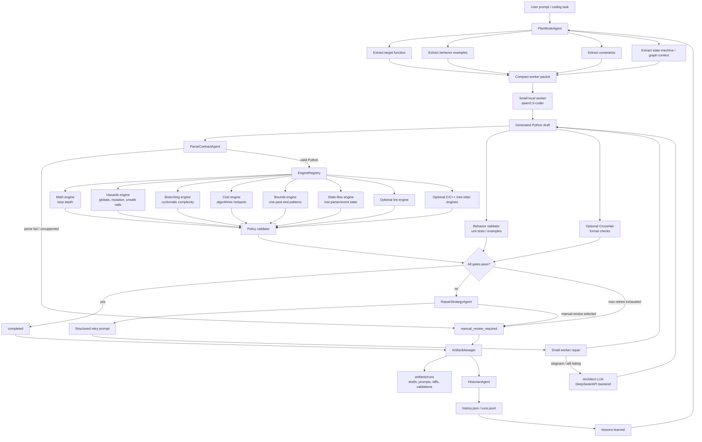

# Agent Small Harness

A Python-first code-generation and repair harness for testing whether small local
LLMs can produce reliable code when wrapped in deterministic software
engineering gates.

The project is built around a simple idea:

```text
small model output -> parse gate -> static engines -> behavior tests
                   -> repair loop -> optional architect escalation
                   -> completed or human review
```

This is not a chatbot wrapper. It is an execution and validation system for
measuring how much a constrained model, static analysis, behavior validation,
and escalation policy contribute to generated code quality.

## Why This Exists

Small coding models are fast and cheap, but they often fail on multi-constraint
tasks: edge cases, state tracking, branch control, mutation, and malformed input.
This harness tests a practical alternative to blindly using a larger model:

- give the small worker a compact task packet
- force every draft through deterministic checks
- repair only from concrete findings
- escalate to a larger API model only when evidence shows the worker is stuck
- record artifacts so failures can be inspected instead of guessed at

The current focus is Python. C/C++ structural analysis exists as an optional
future path, but Python is the reliable development target.

## Current Capabilities

- Python parse contract before any engine runs
- loop-depth analysis
- cyclomatic complexity and branch-density analysis
- global and module-state mutation checks
- dependency and registered-library API checks
- algorithmic-cost hotspot checks
- advisory out-of-bounds read/write pattern checks
- state-flow checks for helpers that drop parser/event state updates
- optional Pylint-backed lint engine
- behavior validation with explicit input/output cases
- optional CrossHair formal-validation smoke path
- Plan Mode compact worker packets
- local Ollama worker support
- DeepSeek/OpenAI-compatible architect escalation
- artifact trail for each attempt
- model ladders for measuring worker breaking points
- historian logs and aggregate route statistics

## Architecture



Execution flow:

```text
User task
  -> Plan Mode extracts function, examples, constraints, and graph context
  -> small worker writes Python code
  -> parse gate rejects invalid or unsupported code
  -> static engines score loop depth, mutation, branching, cost, and lint
  -> behavior validator checks concrete examples
  -> optional CrossHair checks formal/contract cases
  -> passing code is completed and recorded
  -> failing code gets a scoped retry prompt
  -> stagnant failures escalate to the architect model
  -> unresolved or risky failures become manual_review_required
```

Core files:

| Path | Purpose |
| --- | --- |
| `agents/generation_controller.py` | Main create/repair loop, stagnation guard, escalation, final status |
| `agents/plan_mode.py` | Extracts compact specs, examples, state-machine rules, and library adapter notes |
| `agents/engine_registry.py` | Routes code to the correct engine set |
| `agents/parse_contract.py` | Blocks unsupported or unparsable syntax |
| `agents/config_loader.py` | Loads typed settings from `config.yaml` |
| `engines/` | Static analysis engines |
| `validation/behavior.py` | Sandboxed behavior checks for generated Python |
| `validation/policy.py` | Converts findings into blocking/non-blocking violations |
| `backends/ollama_client.py` | Local worker model client |
| `backends/architect_client.py` | API-backed architect repair client |
| `scripts/run_worker_limit.py` | Difficulty ladder for local worker models |
| `scripts/run_raw_vs_harness.py` | Raw model vs harness comparison |
| `structure.md` | Full file-by-file repo map |
| `context.md` | Session notes and experiment context |
| `design.md` | Design constraints and architectural rationale |

## Quick Start

Run the deterministic unit suite:

```bash
make test
```

Evaluate the static engines on snippet fixtures:

```bash
make evaluate-engines
```

Run the behavior validator tests:

```bash
make test-behavior
```

Run the offline coding-capability harness without model calls:

```bash
make test-coding-capability-fixture
```

Run the Plan Mode extraction ladder:

```bash
make test-plan-mode-ladder
```

## Local Model Tests

Install/pull an Ollama coding model first:

```bash
ollama pull qwen2.5-coder:1.5b
ollama pull qwen2.5-coder:3b
```

Push the worker through progressively harder tasks:

```bash
make test-worker-limit MODEL=qwen2.5-coder:3b SAVE_ARTIFACTS=1
```

Use config-driven model routing:

```bash
make test-worker-limit-auto SAVE_ARTIFACTS=1
```

Compare raw one-shot model output against the harness:

```bash
make test-raw-vs-harness MODEL=qwen2.5-coder:3b
```

Focused Python ladders:

```bash
make test-python-ladder-parsing MODEL=qwen2.5-coder:3b
make test-python-ladder-data MODEL=qwen2.5-coder:3b
make test-python-ladder-algorithmic MODEL=qwen2.5-coder:3b
make test-python-ladder-stateful MODEL=qwen2.5-coder:3b
```

## Architect Escalation

The architect is a repair worker behind the same gates. It does not replace the
engines.

Create a local `.env` file:

```env
DEEPSEEK_API_KEY=your_key_here
ARCHITECT_MODEL=deepseek-v4-pro
```

`.env` is ignored by git. Use `.env.example` as the safe template.

Run the local-worker plus architect path:

```bash
make test-coding-capability-architect SAVE_ARTIFACTS=1
make test-worker-limit-architect MODEL=qwen2.5-coder:3b SAVE_ARTIFACTS=1
make test-python-ladder-stateful-architect MODEL=qwen2.5-coder:3b SAVE_ARTIFACTS=1
```

## Configuration

Defaults live in `config.yaml`.

```yaml
engines:
  policy:
    max_loop_depth: 2
    max_cyclomatic_complexity: 7
    allow_explicit_globals: false
    allow_module_state_mutation: false
    allow_external_dependencies: false
    allow_unknown_registered_apis: false
    allow_unsafe_calls: false
    allow_algorithmic_hotspots: false
    allow_bounds_warnings: true
    allow_state_flow_warnings: false
    allow_lint_errors: false

execution:
  models:
    worker_model: qwen2.5-coder:1.5b
    architect_model: deepseek-v4-pro
    difficulty_models:
      1-2: qwen2.5-coder:1.5b
      3-5: qwen2.5-coder:3b
      6+: qwen2.5-coder:7b
  gates:
    max_retries: 1
```

## Current Evidence

Recent deterministic checks:

- `make test`: 156 passing tests
- `make evaluate-engines`: engine recall reported as `1.0`
- `make test-coding-capability-fixture`: 7/7 completed without model calls

Recent live model observations:

| Model | Raw behavior pass rate | Harness completion rate | Notes |
| --- | ---: | ---: | --- |
| `qwen2.5-coder:1.5b` | 3/7 | 3/7 | Harness repaired `parse_int_list`, but harder semantic tasks failed |
| `qwen2.5-coder:3b` | 5/7 | 4/7 | Better raw coding; still fails stateful/config and dependency-order tasks |

Raw 3B code shape from the worker ladder:

| Task | Raw LOC | Raw loop depth | Raw cyclomatic complexity | Behavior |
| --- | ---: | ---: | ---: | --- |
| `sum_even_numbers` | 6 | 1 | 3 | pass |
| `dedupe_by_key` | 8 | 1 | 4 | pass |
| `parse_int_list` | 14 | 1 | 5 | pass |
| `compact_ranges` | 21 | 1 | 6 | pass |
| `merge_inventory_events` | 18 | 1 | 9 | fail |
| `parse_sectioned_config` | 23 | 1 | 8 | fail |
| `resolve_dependency_order` | 24 | 2 | 12 | pass behavior, blocked by static quality |

Interpretation: 3B writes much better raw code than 1.5B, but it still becomes
branch-heavy and semantically fragile on stateful/data-logic tasks. The harness
improves some repairable failures and blocks structurally risky code, but it does
not yet solve every hard semantic task.

Latest stateful/D6 observations:

- `make test-python-ladder-stateful MODEL=qwen2.5-coder:3b SAVE_ARTIFACTS=1`
  completed difficulty 1 and broke at difficulty 2 on `parse_sectioned_config_stateful`.
- Focused D6 run with architect escalation:
  `parse_sectioned_config` ended `manual_review_required`, contribution
  `small_made_progress_but_failed:0.25`.
- The final artifact surfaced unresolved `cyclomatic_complexity` and
  `state_flow_risk`, plus behavior mismatches. That is the intended safety
  behavior: the harness refused a semantically wrong parser.

## Research Questions

This repo is useful for studying:

- where small coding models break
- whether static engines improve repair outcomes
- when behavior validation catches static-clean hallucinations
- how much contribution comes from the small worker vs the architect
- whether compact Plan Mode packets improve first-pass success
- when escalation is cheaper than repeated local retries
- which engine findings are helpful vs noisy

## Current Limitations

- Bounds analysis is intentionally warning-first. It catches high-confidence
  Python one-past-end patterns such as `xs[len(xs)]`, but it is not a full
  formal bounds proof.
- State-flow analysis is intentionally narrow. It catches helpers that assign to
  state-like parameters without returning the updated value, but it is not a
  general dataflow verifier.
- Python behavior validation only catches runtime bugs when a behavior case
  executes the bad path.
- C/C++ support is structural only. Compile/run behavior validation is deferred.
- Pylint is optional and skipped if unavailable.
- CrossHair and Deal tooling are optional; absence produces skips, not failures.
- The architect API can still fail or produce non-compliant code; all architect
  output is revalidated before acceptance.

## Jobs/Portfolio Summary

This project demonstrates:

- deterministic orchestration around LLM code generation
- AST-based static analysis
- behavior-driven validation
- local model and API model integration
- config-driven routing
- artifact logging for human review
- empirical model evaluation through ladders
- clear safety boundaries between generated code and the harness

It is intentionally written as a small, inspectable system rather than a large
framework. The goal is to make each model failure observable and measurable.

## Safety Notes

- Do not commit real API keys.
- Keep `.env` local.
- Generated code should be validated before use.
- Use artifacts under `artifacts/runs/` for review; they are ignored by git.
- Treat `manual_review_required` as a successful safety stop, not a crash.

## Useful References

- `structure.md`: file-by-file repo structure
- `context.md`: current experiment state and prior results
- `design.md`: design decisions and constraints
- `agent-harness.txt`: earlier architecture sketch
