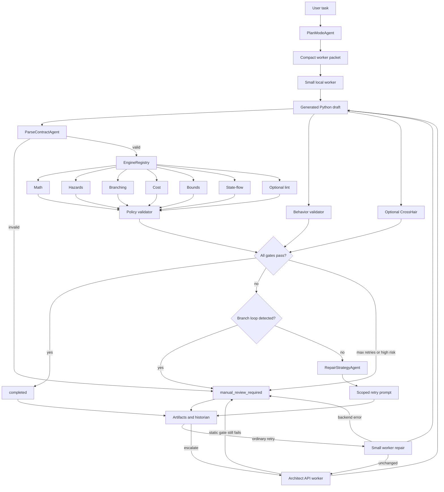
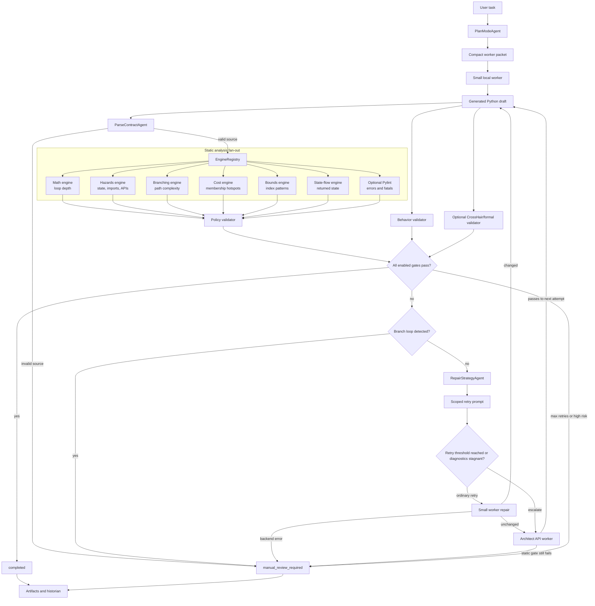

# Agent Small Harness

Agent Small Harness is a Python-first research and engineering prototype for
validated code generation. It studies how far small local coding models can go
when they are wrapped in deterministic software-engineering gates, scoped repair
prompts, artifact logging, and optional architect-model escalation.

The project is designed for two audiences:

- Research: measuring model contribution, repair loops, static-analysis value,
  behavior validation, and escalation boundaries.
- Jobs and portfolio review: demonstrating practical systems engineering around
  LLM code generation, not just prompt demos.

## Core Idea

The model writes code, but the harness decides whether the code is acceptable.

```text
user task
  -> Plan Mode / compact task packet
  -> small local worker model
  -> parse contract
  -> static engines
  -> behavior and optional formal validation
  -> scoped repair prompt
  -> optional architect escalation
  -> completed or manual_review_required
```

Every draft, including output from the architect model, must pass the same gates.
No model output is trusted by default.

## Current Scope

The reliable target is Python.

C and C++ tree-sitter support exists as an optional structural-analysis path, but
the main development lane is Python code creation, repair, and validation.

The harness is intentionally generalized. Example specs such as Snake and Pong
are kept as external experiment inputs and smoke-test fixtures, not as the
definition of the product or controller behavior.

## Interactive Document

`agent-harness.txt` is an interactive architecture sketch for discussing the
operator flow. It is useful for orientation, but it is not the executable
source of truth.

When the text diagram and the code disagree, trust the code in:

- `agents/` for orchestration, routing, repair, and artifact handling
- `harness_kernel/` for the shared execution boundary and structured task handoff; the name avoids collision with the Kernel browser SDK
- `engines/` and `validation/` for deterministic acceptance gates
- `scripts/` and `Makefile` for the runnable operator surface

In particular, the `Warp Terminal Pause`, numbered agent labels, and staged
preprocessing/post-processing blocks in `agent-harness.txt` should be read as a
conceptual walkthrough rather than a literal runtime pipeline. The current
runtime is the create/repair loop shown below and implemented in
`GenerationController`, `PlanModeAgent`, and the registered validation stack.

## Engine Layer

Python drafts pass through a registered engine set:

| Engine | Purpose |
| --- | --- |
| Parse contract | Rejects invalid or unsupported source before analysis |
| Math engine | Measures loop nesting and growth risk |
| Hazards engine | Flags global/module-state mutation, unsafe calls, external imports, and unknown registered-library APIs |
| Branching engine | Measures cyclomatic complexity and branch density |
| Cost engine | Detects avoidable algorithmic hotspots such as repeated linear membership in loops |
| Bounds engine | Warns on high-confidence out-of-bounds read/write patterns |
| State-flow engine | Flags helper functions that update parser/event state without returning it |
| Lint engine | Optional Pylint-backed fatal/error gate |

Static checks are paired with behavior validation. A draft can be structurally
clean and still fail if it does not satisfy the expected input/output behavior.

## Execution Flow



### Codebase Map: Controller, Gates, and Repair

The diagram below is the runtime shape implemented by `GenerationController`.
The vertical path is one attempt. The right-hand path is the bounded repair
loop; the architect is a fallback worker, not a separate acceptance path.



### What Each Engine Traverses

Every Python engine exposes `scan(source)` and returns `EngineFinding` records.
The registry runs them in one pass over the draft, then `validation/policy.py`
turns the findings into blocking or advisory violations. The traversal details
below describe what each loop is doing and what it can detect.

| Engine | Traversal and loop behavior | What it checks | Result |
| --- | --- | --- | --- |
| `engine-0-decomposition` | `_IRBuilder` walks the complete AST. Function visits push and pop `scope_stack`; `for` and `while` visits increment/decrement loop depth and record a nested path; assignment, augmented-assignment, call, `if`, and `global` visitors record structural facts. | Builds the shared structural view: functions, loop types/depth, branches, mutations, explicit globals, module containers, symbols, membership checks, bounds risks, and state-flow risks. | `StructuralIR`, consumed by Math, Hazards, Branching, Cost, Bounds, and State-flow. It is a supporting analysis rather than a registered policy gate. |
| `engine-1-math` | Reuses `StructuralIR.loops` and scans the recorded loop list for the maximum depth and deepest path. | Whether nesting exceeds the policy threshold of two; reports the loop path and its `for`/`while` shape. | One low/medium/high finding with `max_loop_depth`; policy blocks values above the configured limit. |
| `engine-2-hazards` | Reuses IR mutation/global records. Separate AST walks iterate import nodes to classify dependencies, import bindings to resolve registered libraries, and call nodes to validate API paths. | Explicit `global`, mutation of module-level containers, indexed module-state writes, non-standard-library imports, and calls missing from a registered library schema. | One finding per hazard category, with names, calls, imports, locations, and repair hints. |
| `engine-3-branching` | Starts with IR loops and branches, then walks the AST for exception handlers, assertions, conditional expressions, boolean operands, and comprehension filters. A nested function visitor repeats the decision count per function while skipping nested functions. | Cyclomatic-style path density at module and function scope, including decisions that are not plain `if` statements. | Complexity metrics and the worst function; policy blocks complexity above seven. |
| `engine-4-cost` | Consumes `StructuralIR.symbols` and `StructuralIR.membership_checks`. The IR builder records assignments, annotations, arguments, constructors, `for`/`while`, comprehensions, and `in`/`not in` comparisons with scope and line information. | Repeated membership against an inferred `list` or `tuple` inside a loop, which can become an avoidable linear lookup hotspot. | Container names, lines, and hotspot count; policy can require a precomputed set. |
| `engine-5-lint` | Writes the draft to a temporary file and delegates traversal to Pylint. It parses the returned JSON and filters registered dynamic-library `no-member` messages into non-blocking warnings. | Pylint fatal/error categories, while allowing known dynamic members from the library registry. | Blocking lint findings or an explicit skipped/unavailable/timeout result. It is optional and external to the AST IR. |
| `engine-6-bounds` | Consumes `StructuralIR.bounds_risks`, populated while the IR builder visits every subscript and `for` loop whose iterator is a `range(...)` call. | High-confidence one-past-end reads/writes and range upper-bound overflow patterns. | Warning-first bounds finding with expressions and lines; full dataflow proof is intentionally out of scope. |
| `engine-7-state-flow` | Consumes `StructuralIR.state_flow_risks`, populated while the IR builder walks each function’s descendant nodes for state-parameter assignments and return values. | Helpers that mutate parameters named like state/context/section/current/total but fail to return the updated value. | Potential lost-state finding with function, parameter, and line; policy blocks it by default. |

#### Current IR Boundary

`DecompositionEngine` is the shared structural source for Math, Hazards,
Branching, Cost, Bounds, and State-flow. The IR now carries scope-qualified
symbols, membership checks, bounds risks, and state-flow risks so those engines
do not need their own top-level `ast.NodeVisitor` for the same facts. Lint
remains separate because Pylint owns its traversal and is intentionally external
to the Python IR.

#### Reading a Finding

The engine finding is not the final decision. The path is:

```text
AST/source
  -> engine traversal
  -> EngineFinding(metrics, diagnostic, severity)
  -> policy threshold and allow-list evaluation
  -> structural violation set
  -> repair prompt, completion, or manual review
```

This is why a low-severity finding can still be useful telemetry, while a
high-severity finding only blocks the run when its corresponding policy says it
is disallowed.

Structured app specs can also use the function-contract queue path:

```text
structured spec
  -> PlanModeAgent
  -> fallback or architect-ordered contract queue
  -> sequential function/class contract generation
  -> per-contract validation and repair
  -> architect integration of accepted symbols
  -> normal parse, engine, policy, behavior, and formal gates
  -> completed or manual_review_required
```

This path is what app-scale smoke specs such as Pong and Snake exercise. It has
its own failure modes: contract dependency blocking, oversized integration
prompts, architect truncation, and final module-level static/spec validation.
Those outcomes are recorded in artifact metadata and the contract queue results.

## Important Design Properties

- Python-first: the stable path uses the standard-library `ast` stack.
- Generalized: no app-specific route is baked into the controller or Plan Mode.
- Deterministic gates: parsing, static checks, policy, behavior, and optional
  formal validation decide completion.
- Architect is not trusted: API output is rescanned by the same gates.
- Artifact-driven review: attempts, prompts, diffs, validations, and summaries
  are saved under `artifacts/runs/` when requested.
- Contribution measurement: ladder tests record whether the small worker solved,
  repaired, helped the architect, stalled, or required manual review.

## Repository Map

| Path | Purpose |
| --- | --- |
| `agents/generation_controller.py` | Main create/repair loop, stagnation guard, branch-loop detection, architect escalation, final status |
| `agents/plan_mode.py` | Converts raw user intent into compact task specs, behavior examples, constraints, graph context, and `TaskIR` |
| `agents/engine_registry.py` | Routes parsed source to the registered engine set |
| `agents/job_store.py` | File-locked append-only JSONL job store used by asynchronous run/status endpoints |
| `agents/parse_contract.py` | Language detection and parser gate |
| `agents/repair_strategy.py` | Converts violations into scoped repair instructions |
| `agents/template_registry.py` | Optional injected template-route selector, with no built-in app-specific route |
| `harness_kernel/task_ir.py` | Structured task/spec handoff types |
| `harness_kernel/function_contracts.py` | Function-level contract queue and Deal scaffold rendering |
| `harness_kernel/execution_kernel.py` | Thin execution wrapper around the controller |
| `engines/` | Static analysis engines |
| `validation/` | Policy, behavior, Deal/CrossHair formal validation, branch-loop detection, and violation types |
| `prompt/` | Initial, retry, architect, and contract-architect prompt builders |
| `backends/` | Ollama worker and API architect clients |
| `api/` | Minimal synchronous FastAPI request boundary |
| `scripts/` | Ladder runners, raw-vs-harness comparison, history aggregation, review tools |
| `tests/` | Unit, integration, edge-case, ladder, and pipeline tests |
| `pyproject.toml` | Python package metadata and runtime dependencies |
| `Dockerfile` | Container entrypoint for the synchronous API service |
| `.github/workflows/ci.yml` | Push/PR workflow for tests and Docker image build |
| `agent-harness.txt` | Conceptual interactive flow document for operator discussion; not the authoritative runtime spec |
| `context.md` | Current project context and experiment notes |
| `design.md` | Architectural constraints and safety principles |
| `structure.md` | File-by-file repository map |

## Setup

Install optional dependencies:

```bash
make install
make install-formal
```

Pull local Ollama models as needed:

```bash
ollama pull qwen2.5-coder:1.5b
ollama pull qwen2.5-coder:3b
```

For architect escalation, create a local `.env` file:

```env
DEEPSEEK_API_KEY=your_key_here
ARCHITECT_MODEL=deepseek-v4-pro
```

`config.yaml` separates architect profiles:

- `execution.architect.contract` uses a bounded `deepseek-chat` JSON-only path for function contract queues.
- `execution.architect.repair` uses a separate bounded repair profile for code repair after worker failure.

`.env` is ignored by git. Use `.env.example` as the committed template.
Transient architect API failures are retried by default. Tune
`ARCHITECT_RETRY_ATTEMPTS` and `ARCHITECT_RETRY_BACKOFF_SECONDS` in `.env` when
needed.

Check the env-file location and supported key names:

```bash
make env-path
```

## Common Commands

Show command help:

```bash
make help
```

Run the minimal synchronous API:

```bash
make api-dev
```

The first service boundary is intentionally small:

```text
GET  /health
POST /runs/sync
POST /runs/async
GET  /runs/{job_id}
```

`POST /runs/sync` accepts `target`, `spec`, optional `max_retries`, `language`,
`model`, `ollama_url`, and `use_architect`. The default app wires `spec` through
`OllamaModelSupplier.generate_draft`, uses the same supplier for repairs, and
optionally enables `ArchitectModelSupplier.repair_draft` for escalation. It then
calls `GenerationController.run()` synchronously and returns the validated
controller result.

Backend failures return structured JSON with an error code and recovery action
instead of an unstructured server error.

`POST /runs/async` returns a job ID immediately and runs the same controller in
the background. `GET /runs/{job_id}` reads its persisted status, lifecycle
events, and result from `JsonlJobStore`. Set `JOB_STORE_PATH` to change the
default `data/jobs.jsonl` location.

Build the local API image:

```bash
make docker-build
```

The image runs `uvicorn api.app:app` on port `8000`. Pass secrets such as
`DEEPSEEK_API_KEY` at runtime; `.env` is excluded from the image context.

Run deterministic validation:

```bash
make test
make evaluate-engines
make test-behavior
make test-engine-edge-cases
```

Run model capability experiments:

```bash
make test-worker-limit MODEL=qwen2.5-coder:3b SAVE_ARTIFACTS=1
make test-worker-limit-auto SAVE_ARTIFACTS=1
make test-raw-vs-harness MODEL=qwen2.5-coder:3b
```

Run focused Python ladders:

```bash
make test-python-ladder-parsing MODEL=qwen2.5-coder:3b
make test-python-ladder-data MODEL=qwen2.5-coder:3b
make test-python-ladder-algorithmic MODEL=qwen2.5-coder:3b
make test-python-ladder-stateful MODEL=qwen2.5-coder:3b
```

Run architect escalation:

```bash
make test-worker-limit-architect MODEL=qwen2.5-coder:3b SAVE_ARTIFACTS=1
make test-python-ladder-stateful-architect MODEL=qwen2.5-coder:3b SAVE_ARTIFACTS=1
```

Review saved artifacts:

```bash
make review-run RUN=<run-id-or-path>
```

Discover a library API surface and ask DeepSeek for documentation by default:

```bash
make discover-library LIB=clang.cindex
```

That command writes a reviewable proposal to
`data/library_proposals/<LIB>.json` and a model-generated syntax guide to
`data/library_proposals/<LIB>.docs.md`. Use `DOC_AGENT=qwen` to ask local Qwen,
`DOC_AGENT=kernel` to search and verify documentation pages in a Kernel cloud
browser, or `DOC_AGENT=none` to write an import-only proposal without
documentation search. Kernel search requires `requirements-kernel.txt` and
`KERNEL_API_KEY` in `.env`.

Approve a reviewed proposal into the trusted library registry:

```bash
make approve-library LIB=clang.cindex
```

## Research Questions This Repo Supports

- Does a deterministic engine layer improve small-model code reliability?
- Which failures are structural and which are semantic?
- When does a small local model stop contributing meaningful changes?
- Does compact graph/state context improve repair quality?
- How often does architect escalation rescue a failed small-worker run?
- Which engines produce useful repair pressure, and which create false positives?

## Current Direction

The immediate goal is to harden the Python execution kernel before expanding to
larger multi-file application generation. The next major platform layer is a
stronger Spec/IR builder that can describe target functions, behavior examples,
state transitions, allowed libraries, validation gates, and file scope before
the execution kernel begins generation.

The documentation direction follows the same rule: keep the public story about
generalized code creation and repair, and treat app-like specs as fixtures that
exercise the harness rather than define it.

Library discovery follows the same trust boundary. A discovered package surface
and model-found documentation are proposal data until a human reviews and
approves them into `data/library_registry.json`.

## Safety Boundary

Generated code is never accepted from model text alone. The controller requires
successful parsing, registered engine checks, policy validation, behavior
validation when available, and optional formal checks when enabled. Otherwise the
run ends as `manual_review_required`.
