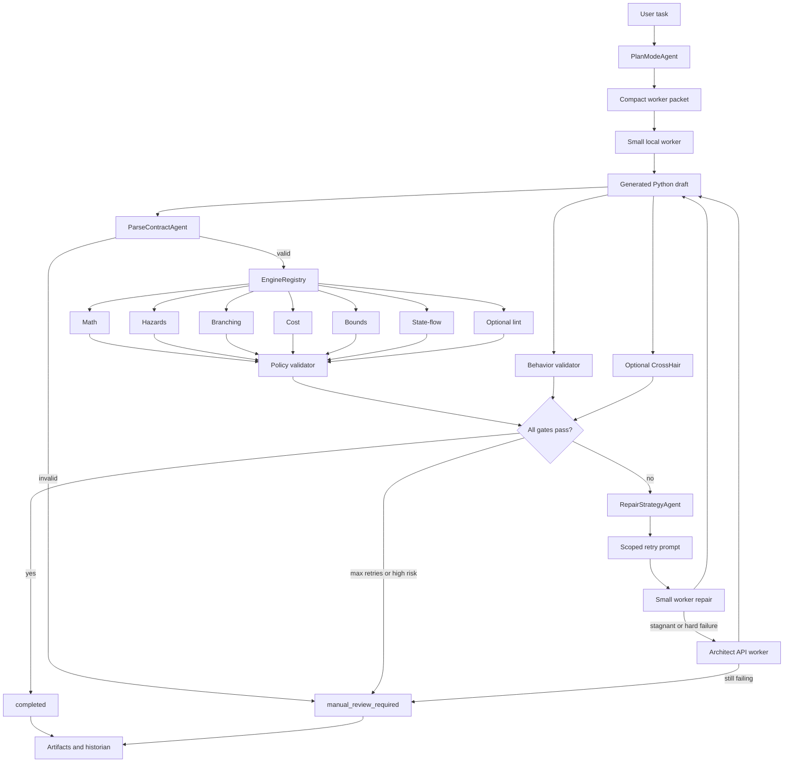

# Agent Small Harness

Agent Small Harness is a Python-first research and engineering prototype for
validated code generation. It studies how far small local coding models can go
when they are wrapped in deterministic software-engineering gates, scoped repair
prompts, artifact logging, and optional architect-model escalation.

The project is designed for two audiences:

- Research: measuring model contribution, repair loops, static-analysis value,
  behavior validation, and escalation boundaries.
- Jobs and portfolio review: demonstrating practical systems engineering around
  LLM code generation, not just prompt demos.

## Core Idea

The model writes code, but the harness decides whether the code is acceptable.

```text
user task
  -> Plan Mode / compact task packet
  -> small local worker model
  -> parse contract
  -> static engines
  -> behavior and optional formal validation
  -> scoped repair prompt
  -> optional architect escalation
  -> completed or manual_review_required
```

Every draft, including output from the architect model, must pass the same gates.
No model output is trusted by default.

## Current Scope

The reliable target is Python.

C and C++ tree-sitter support exists as an optional structural-analysis path, but
the main development lane is Python code creation, repair, and validation.

The harness is intentionally generalized. Example specs such as Snake and Pong
are kept as external experiment inputs and smoke-test fixtures, not as the
definition of the product or controller behavior.

## Interactive Document

`agent-harness.txt` is an interactive architecture sketch for discussing the
operator flow. It is useful for orientation, but it is not the executable
source of truth.

When the text diagram and the code disagree, trust the code in:

- `agents/` for orchestration, routing, repair, and artifact handling
- `kernel/` for the shared execution boundary and structured task handoff
- `engines/` and `validation/` for deterministic acceptance gates
- `scripts/` and `Makefile` for the runnable operator surface

In particular, the `Warp Terminal Pause`, numbered agent labels, and staged
preprocessing/post-processing blocks in `agent-harness.txt` should be read as a
conceptual walkthrough rather than a literal runtime pipeline. The current
runtime is the create/repair loop shown below and implemented in
`GenerationController`, `PlanModeAgent`, and the registered validation stack.

## Engine Layer

Python drafts pass through a registered engine set:

| Engine | Purpose |
| --- | --- |
| Parse contract | Rejects invalid or unsupported source before analysis |
| Math engine | Measures loop nesting and growth risk |
| Hazards engine | Flags global/module-state mutation, unsafe calls, external imports, and unknown registered-library APIs |
| Branching engine | Measures cyclomatic complexity and branch density |
| Cost engine | Detects avoidable algorithmic hotspots such as repeated linear membership in loops |
| Bounds engine | Warns on high-confidence out-of-bounds read/write patterns |
| State-flow engine | Flags helper functions that update parser/event state without returning it |
| Lint engine | Optional Pylint-backed fatal/error gate |

Static checks are paired with behavior validation. A draft can be structurally
clean and still fail if it does not satisfy the expected input/output behavior.

## Execution Flow



## Important Design Properties

- Python-first: the stable path uses the standard-library `ast` stack.
- Generalized: no app-specific route is baked into the controller or Plan Mode.
- Deterministic gates: parsing, static checks, policy, behavior, and optional
  formal validation decide completion.
- Architect is not trusted: API output is rescanned by the same gates.
- Artifact-driven review: attempts, prompts, diffs, validations, and summaries
  are saved under `artifacts/runs/` when requested.
- Contribution measurement: ladder tests record whether the small worker solved,
  repaired, helped the architect, stalled, or required manual review.

## Repository Map

| Path | Purpose |
| --- | --- |
| `agents/generation_controller.py` | Main create/repair loop, stagnation guard, branch-loop detection, architect escalation, final status |
| `agents/plan_mode.py` | Converts raw user intent into compact task specs, behavior examples, constraints, graph context, and `TaskIR` |
| `agents/engine_registry.py` | Routes parsed source to the registered engine set |
| `agents/parse_contract.py` | Language detection and parser gate |
| `agents/repair_strategy.py` | Converts violations into scoped repair instructions |
| `agents/template_registry.py` | Optional injected template-route selector, with no built-in app-specific route |
| `kernel/task_ir.py` | Structured task/spec handoff types |
| `kernel/function_contracts.py` | Function-level contract queue and Deal scaffold rendering |
| `kernel/execution_kernel.py` | Thin execution wrapper around the controller |
| `engines/` | Static analysis engines |
| `validation/` | Policy, behavior, Deal/CrossHair formal validation, branch-loop detection, and violation types |
| `prompt/` | Initial, retry, architect, and contract-architect prompt builders |
| `backends/` | Ollama worker and API architect clients |
| `scripts/` | Ladder runners, raw-vs-harness comparison, history aggregation, review tools |
| `tests/` | Unit, integration, edge-case, ladder, and pipeline tests |
| `agent-harness.txt` | Conceptual interactive flow document for operator discussion; not the authoritative runtime spec |
| `context.md` | Current project context and experiment notes |
| `design.md` | Architectural constraints and safety principles |
| `structure.md` | File-by-file repository map |

## Setup

Install optional dependencies:

```bash
make install
make install-formal
```

Pull local Ollama models as needed:

```bash
ollama pull qwen2.5-coder:1.5b
ollama pull qwen2.5-coder:3b
```

For architect escalation, create a local `.env` file:

```env
DEEPSEEK_API_KEY=your_key_here
ARCHITECT_MODEL=deepseek-v4-pro
```

`config.yaml` separates architect profiles:

- `execution.architect.contract` uses a bounded `deepseek-chat` JSON-only path for function contract queues.
- `execution.architect.repair` uses a separate bounded repair profile for code repair after worker failure.

`.env` is ignored by git. Use `.env.example` as the committed template.

## Common Commands

Show command help:

```bash
make help
```

Run deterministic validation:

```bash
make test
make evaluate-engines
make test-behavior
make test-engine-edge-cases
```

Run model capability experiments:

```bash
make test-worker-limit MODEL=qwen2.5-coder:3b SAVE_ARTIFACTS=1
make test-worker-limit-auto SAVE_ARTIFACTS=1
make test-raw-vs-harness MODEL=qwen2.5-coder:3b
```

Run focused Python ladders:

```bash
make test-python-ladder-parsing MODEL=qwen2.5-coder:3b
make test-python-ladder-data MODEL=qwen2.5-coder:3b
make test-python-ladder-algorithmic MODEL=qwen2.5-coder:3b
make test-python-ladder-stateful MODEL=qwen2.5-coder:3b
```

Run architect escalation:

```bash
make test-worker-limit-architect MODEL=qwen2.5-coder:3b SAVE_ARTIFACTS=1
make test-python-ladder-stateful-architect MODEL=qwen2.5-coder:3b SAVE_ARTIFACTS=1
```

Review saved artifacts:

```bash
make review-run RUN=<run-id-or-path>
```

## Research Questions This Repo Supports

- Does a deterministic engine layer improve small-model code reliability?
- Which failures are structural and which are semantic?
- When does a small local model stop contributing meaningful changes?
- Does compact graph/state context improve repair quality?
- How often does architect escalation rescue a failed small-worker run?
- Which engines produce useful repair pressure, and which create false positives?

## Current Direction

The immediate goal is to harden the Python execution kernel before expanding to
larger multi-file application generation. The next major platform layer is a
stronger Spec/IR builder that can describe target functions, behavior examples,
state transitions, allowed libraries, validation gates, and file scope before
the execution kernel begins generation.

The documentation direction follows the same rule: keep the public story about
generalized code creation and repair, and treat app-like specs as fixtures that
exercise the harness rather than define it.

## Safety Boundary

Generated code is never accepted from model text alone. The controller requires
successful parsing, registered engine checks, policy validation, behavior
validation when available, and optional formal checks when enabled. Otherwise the
run ends as `manual_review_required`.
