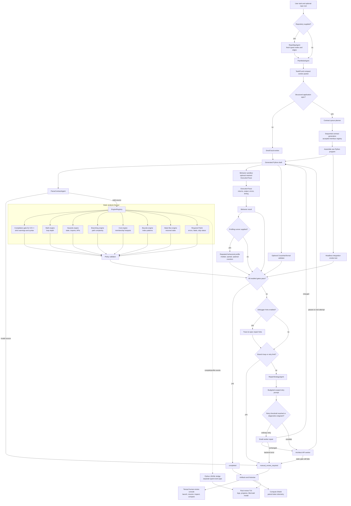

# Agent Small Harness

> Documentation audit: 2026-07-30. Commands and component names below reflect
> the current local tree. Dated files under `docs/` remain historical records.

Agent Small Harness is a Python-first research and engineering prototype for
validated code generation. It studies how far small local coding models can go
when they are wrapped in deterministic software-engineering gates, scoped repair
prompts, artifact logging, and optional architect-model escalation.

The project is designed for two audiences:

- Research: measuring model contribution, repair loops, static-analysis value,
  behavior validation, and escalation boundaries.
- Jobs and portfolio review: demonstrating practical systems engineering around
  LLM code generation, not just prompt demos.

## Core Idea

The model writes code, but the harness decides whether the code is acceptable.

```text
user task
  -> optional fresh repository map
  -> Plan Mode / TaskIR / compact worker packet
  -> small local worker model
  -> parse contract
  -> static engines
  -> real behavior execution trace and optional formal validation
  -> optional debugger hints and scoped repair prompt
  -> optional architect escalation
  -> completed or manual_review_required
```

Every draft, including output from the architect model, must pass the same gates.
No model output is trusted by default.

## Current Scope

The reliable target is Python.

C and C++ have a strict compiler gate. Tree-sitter remains the optional
structural-analysis layer, while the main development lane is Python code
creation, repair, and validation.

The harness is intentionally generalized. Example specs such as Snake and Pong
are kept as external experiment inputs and smoke-test fixtures, not as the
definition of the product or controller behavior.

### Implemented Features

| Capability | Current behavior |
| --- | --- |
| Repository mapping | `RepoMapAgent` walks Python files with `ast`, records functions, calls, returns, classes, all discovered variables, mutations, loop depth, and classified imports, and emits typed graph nodes/edges for compact Plan Mode context, JSON artifacts, or live Mermaid output. |
| Structured planning | `PlanModeAgent` builds `TaskIR`, behavior examples, state rules, graph context, adapter constraints, and compact worker packets. Repo context is opt-in through a supplied root or graph. |
| Local model generation | Ollama workers use configurable Qwen model profiles; harder failures can escalate to a separately configured architect model. |
| Deterministic validation | Parsing, seven Python engine checks, policy evaluation, required Pylint, behavior checks, optional Deal examples, and optional CrossHair decide acceptance. |
| Runtime tracing | `ExecutionAgent` runs parsed drafts against behavior cases in a timeout-bound child with a disposable working directory and sanitized environment, then captures returns, stdout, stderr, exceptions, timing, and match status in an `ExecutionTrace`. |
| Debugger hints | The opt-in debugger hook converts trace/spec differences into bounded repair instructions instead of returning only a generic behavior failure. |
| Bounded repair | Retry prompts preserve current failures and drafts under a prompt budget, detect stagnation/branch loops, and validate every worker or architect revision again. |
| Structured-spec applications | Architect-ordered contract queues carry accepted field types and method arities forward, validate imports per contract, assemble one Python program, and run contract examples plus the headless smoke test outside the harness process with sanitized environments and disposable working directories. |
| Review evidence | Optional run artifacts preserve prompts, attempts, diffs, findings, execution traces, validation results, token estimates, and timelines. |
| Human review TUI | The existing Textual process remains the stable interface. A Rust `ratatui` client now provides a non-blocking JSONL subprocess bridge and an in-process Mermaid-to-terminal-image modal; it is an additive preview until parity is verified. |
| C/C++ compilation gate | Registered C/C++ drafts run a strict, timeout-bounded compiler pass (`-Wall -Wextra -Werror -fsyntax-only`) before later validation. Optional tree-sitter engines add structural checks when installed. |
| Algorithmic profiling | An opt-in behavioral profiler measures repeated callable variants, reports median/spread and optional hardware counters, and only identifies a faster ordering beyond a documented noise floor. |
| Compute Shield metrics | A task-level evaluator reads recorded model-token telemetry from paired artifacts, preserves each comparison row, and reports the exact aggregate delta; it is evidence, not an acceptance gate. |
| API boundary | FastAPI exposes synchronous runs, asynchronous submission, persisted job status, and health checks. |

## Engine Layer

Python drafts pass through a registered engine set:

| Engine | Purpose |
| --- | --- |
| Parse contract | Rejects invalid or unsupported source before analysis |
| Math engine | Measures loop nesting and growth risk |
| Hazards engine | Flags global/module-state mutation, unsafe calls, external imports, and unknown registered-library APIs |
| Branching engine | Measures cyclomatic complexity and branch density |
| Cost engine | Detects avoidable algorithmic hotspots such as repeated linear membership in loops |
| Bounds engine | Warns on high-confidence out-of-bounds read/write patterns |
| State-flow engine | Flags helper functions that update parser/event state without returning it |
| Lint engine | Required Pylint-backed fatal/error gate; skipped runs require explicit policy allowance |
| Compilation engine | For C/C++, invokes an available Clang/GCC compiler with warnings promoted to errors and returns bounded diagnostics |

Static checks are paired with behavior validation. A draft can be structurally
clean and still fail if it does not satisfy the expected input/output behavior.

The algorithmic profiler is intentionally not a default static engine: callers
must supply two behaviorally equivalent operations to compare, so it cannot
infer performance from AST shape or accidentally reject unrelated tasks.
Compute Shield is likewise an evaluation metric rather than a gate.

`GenerationController(profiling_runner=...)` is the opt-in integration seam.
Results and failures are stored on every attempt, included in checkpoints and
review artifacts, surfaced in the Textual console, and used by the existing
repair/manual-review decision path. With no runner, the attempt shape records
profiling as disabled and behavior is unchanged.

## Rust TUI preview

The Rust interface owns the terminal while Python continues to own the harness,
models, engines, and artifacts. They communicate through newline-delimited JSON
over a local subprocess—no server or port is introduced.

```bash
make rust-tui REPO_ROOT=.
make test-rust
```

The Rust crate lives under `rust/`; its `mermaid_view` module contains the
in-process SVG-to-PNG pipeline and Kitty/iTerm2/quadrant-block terminal
renderers. Run Cargo directly with `cargo --manifest-path rust/Cargo.toml`
when you need a Rust-specific command.

The primary view is a high-contrast, Codex-inspired linear event stream: a
compact session line, `─` turn dividers, and `•`/`└` event trees. A persistent
status strip above the bottom composer shows activity, repository directory,
reported local context, the local `qwen2.5-coder:1.5b` model, and DeepSeek API
availability. `ctx —` means no local generation has completed yet; after a
generation it shows the backend-reported token total and remaining share of its
configured context window. Press `c`, `p`,
or `a` to focus the same unified multi-line composer; `Enter` adds a line and
`Ctrl+Enter` sends. Its footer exposes keyboard-first `send`, `/tools`, and
`/spec` actions. Every
non-planning message goes through the local Qwen 1.5B assistant with bounded,
read-only repository tools available when they help; ordinary conversation
finishes directly without a tool call. New project ideas automatically open a typed 2–4 question
clarification flow. Each question has numbered choices plus a mandatory `Other`
option; `1`–`5` answers locally, while `Other` opens free-text input.
Completing the final question asks DeepSeek to fill a strict JSON execution
sheet from the conversation and answers. The bridge validates that sheet and
renders deterministic planner-compatible Markdown with explicit files,
components, entrypoints, dependencies, rules, examples, and checks. An invalid
or incomplete sheet returns to chat as an error instead of reaching execution.
`s` remains available to draft directly when no more
clarification is needed. The TUI then opens a review gate: `y` explicitly sends
that spec through DeepSeek contract planning and the small-worker queue, while
`n` or `Esc` returns to chat for revision. Greetings, chat, and questionnaire
answers can never start workers.

If DeepSeek's optional queue-ordering response is malformed, the approved
spec-sheet components provide a validated local contract queue and execution
continues with a warning. Execution only stops when neither source can produce
a contract queue.

The event stream follows the newest event while a run is active. Use `Up`/`Down`,
`PageUp`/`PageDown`, or the mouse wheel to inspect earlier output;
`Home` jumps to the beginning and `End` resumes live following. After every
successfully completed engine and integration-validation pass, the TUI opens a
line-numbered validated-code view. That view supports vertical and horizontal
arrow scrolling, `PageUp`/`PageDown`, and `v`/`Esc` to close; press `v` from the
main view to reopen the latest validated source.

The session line reports whether DeepSeek was configured from the environment
or repository `.env` without displaying the key. Explicit phrases such as
`/remember keep responses concise`, `remember that ...`, or `I prefer ...`
store a bounded preference in ignored `.tui_memory.json`. Those preferences are
injected into later chat and spec-drafting prompts. The Rust TUI also refreshes
an ignored `context.md` journal after bridge events. It keeps the current mode,
engine status, and a bounded recent-activity list for the next local session;
API-key-looking values are redacted and the journal is never sent to the model
automatically. Messages containing credential-like preferences are refused by
the memory extractor.

The session line shows the active directory and current status; the terminal no
longer renders the diagram or file browser. Context is never inferred from the
visible log: Ollama reports its prompt/evaluation token counts, while the
architect API reports its response usage. The local and API records, plus the
running API cost estimate when available, are persisted in the ignored
`context.md` session journal.
Planning questions only begin for an explicit software request: the message
must include both planning/build intent and a coding target such as an app,
script, API, CLI, game, repository, or feature. Non-coding requests stay in
ordinary chat. Press `m` to build a map on loopback, then `o` to open its
temporary browser page.

Chat and tools share one intake rule: an explicit software-planning request is
routed to the same questionnaire and spec-review path before any repository
tool calls. Requests to create, replace, or delete a file can propose a diff,
but remain blocked until the user presses `y`.

Chat roles are visually distinct: user labels are green, assistant labels and
responses are cyan, saved-memory notices are magenta, and warnings/errors keep
their yellow/red emphasis. A compact spinner in the session line animates while
DeepSeek or an approved harness run is active without blocking keyboard input.
Typed questionnaire events use immediate `1`–`5` selection without an IPC
request per answer. The chat prompt includes the detected host OS, so command
guidance does not need an OS follow-up. Explicit repository inspection and
filesystem requests route through the bounded local tool loop. Create, replace,
and delete actions always produce a reviewable diff; `y` is still required
before the local repository changes. Plain assistant messages that contain at
least two numbered choices retain the lighter quick-reference behavior.
Ordinary numbers retain their normal typing behavior everywhere else.

`m` prepares the repository map on loopback; `o` opens it in the browser.
Outside repository focus, `r` retains the coding-capability shortcut. `d` opens
run history, `Esc` leaves the current focus/overlay, and `q` cancels before
exiting.

The retained renderer module supports Kitty/Ghostty graphics, iTerm2/WezTerm
inline images, and a 2×2 quadrant-block fallback for Apple Terminal and Windows
Terminal. The current repository-map path is browser-first, so these renderers
are not invoked by `m`; they remain available for a future native image view.
Renderer detection uses terminal environment markers and does not perform a
blocking stdio capability query.
The Python bridge allowlists
entrypoints and flags and wraps child output in typed log events so ordinary
CLI text cannot corrupt the protocol.

Controller events use a separate inherited file descriptor from CLI stdout.
That keeps human log output and typed `compile_gate_result` /
`profiling_result` messages independent while still using one local child
process.

Paired Compute Shield artifacts can be aggregated without rerunning models:

```bash
make compute-shield COMPUTE_SHIELD_ARGS="\
  --baseline-run matrix=artifacts/runs/baseline-matrix \
  --shielded-run matrix=artifacts/runs/shielded-matrix \
  --output artifacts/compute-shield.json"
```

Rust is required for these two targets. The Textual `make tui` command remains
supported during rollout.

## Execution Flow



The repository map is rebuilt when requested instead of cached. Its JSON graph
contains module, function, variable, and loop nodes plus containment,
declaration, call, import, and mutation edges. Execution
tracing and debugger hints are independently configurable and default off.
Behavior validation still executes real examples when tracing is not retained;
the trace option controls whether the richer evidence is attached to attempts
and made available to the debugger hook. Architect output always returns to the
same parse and validation path as local-worker output. Algorithmic profiling is
also opt-in: a caller supplies a profiling runner with equivalent variants.
When enabled, it participates in the same retry/manual-review path and its
results persist beside behavior and formal evidence.

### Repository tool-calling agent

The typed registry exposes six repository-scoped tools:

- `search_directory` performs bounded glob/substring file discovery while
  skipping generated and dependency directories.
- `read_file` returns bounded repository-relative file content with an explicit
  truncation marker.
- `apply_search_replace` prepares a unified diff and proposed content for
  replacement, file creation, or deletion but never writes it; `applied`
  remains false until a separate human approval path is invoked. The approval
  helper verifies the file state again before writing, so a stale diff is
  rejected.
- `create_file` is the explicit new-file path. It prepares an empty-to-content
  unified diff and remains review-only until the same `y` approval gate.
- `check_code` runs the registered structural and lint engines against one
  supported repository file (`.py`, `.c`, `.cc`, `.cpp`, or `.cxx`) and returns
  typed findings without asking a model to guess whether the code passed.
- `execute_script` runs generated source in a disposable Docker sandbox by
  default: the repository is mounted read-only, networking is disabled, API
  keys are not inherited, and CPU/memory/process/output/time limits are
  bounded. Local execution is available only when an explicit caller selects
  `sandbox_mode="local"` for development or tests.

All filesystem requests pass through one resolved-root guard that rejects
absolute, traversal, and symlink escapes. A bounded model→tool→result loop lets
Qwen or DeepSeek inspect results and choose another tool without granting the
model direct filesystem mutation.

```bash
make tool-agent TASK="inspect the structured-spec integration failure"
make tool-agent TASK="prepare a diff for README.md" TOOL_AGENT=deepseek

# Direct hardened execution smoke test
make sandbox-run SOURCE=/tmp/candidate.py LANGUAGE=python
```

The returned JSON contains the final answer and every typed call/result. Diffs
remain review-only; this command cannot approve or apply them.

The Rust TUI sends all messages through the same loop. Enter a repository
inspection or change request and the bridge streams each typed tool call into
the main output. Read-only tasks finish with an assistant answer. A proposed
create/replace/delete diff opens a review modal; `y` applies it only after the
repository path and reviewed file state are checked again, while `n` or `Esc`
discards it without writing. The prompt also accepts `/help`, `/map`, `/open`,
`/check <repository-file>`, `/history`, `/spec`, `/model`, `/remember <note>`,
`/mention <path>`, and `/tools <task>`.

`/check` is an inline deterministic validation command, not a model prompt. It
streams the registered engines' pass/fail result and findings for the specified
repository-relative file into the event stream.

### Hardened execution and language adapters

Generated source can be executed through typed adapters for Python, C, C++,
Rust, and JavaScript. Container mode is explicit and fail-closed: it requires
Docker or Podman, disables networking by default, uses a read-only root
filesystem, drops Linux capabilities, enables `no-new-privileges`, and bounds
memory, CPU, processes, temporary storage, output, and wall time. It mounts only
the disposable source directory—not the repository or its `.env` file.

```bash
make sandbox-run SOURCE=/tmp/candidate.py LANGUAGE=python
make sandbox-run SOURCE=/tmp/candidate.rs LANGUAGE=rust CONTAINER_RUNTIME=podman
```

For trusted development only, `SANDBOX_MODE=local` selects the existing
sanitized subprocess boundary. A missing container runtime never silently
falls back locally; the CLI requires the separate `--allow-local-fallback`
flag when that behavior is deliberately requested.

The registered repository tools are stricter: their default registry rejects
`sandbox_mode=local` even if a caller supplies it. Local execution is available
only to explicitly trusted in-process callers that construct a registry with
`allow_local_sandbox=True`.

### Paired coding-agent benchmark

`data/agent_benchmark_tasks.json` contains 20 fixed inspection, edit, repair,
safety, language, and recovery tasks. The paired runner sends identical task
JSON to baseline and local-agent-shielded commands, which return success,
prompt/completion tokens, tool calls, and retries. Its report compares outcome
counts, total and per-task token deltas, reduction ratio, and duration.

```bash
make agent-benchmark \
  BASELINE_CMD="./scripts/baseline_runner" \
  SHIELDED_CMD="./scripts/shielded_runner" \
  BENCHMARK_OUTPUT=artifacts/agent-benchmark.json

# DeepSeek-backed runner used for the measured comparison below
make agent-benchmark \
  BASELINE_CMD="python3 scripts/run_deepseek_benchmark_agent.py --mode baseline" \
  SHIELDED_CMD="python3 scripts/run_deepseek_benchmark_agent.py --mode shielded" \
  BENCHMARK_OUTPUT=artifacts/agent-benchmark-deepseek.json
```

This provides evidence for cloud-token reduction without claiming that extra
local inference reduces total tokens across every model.

`scripts/run_ollama_benchmark_agent.py` is available for an explicitly
authorized local-model comparison and records Ollama's prompt/evaluation token
counts. The 3B comparison was intentionally stopped before completion; no 3B
result is used. The authorized 1.5B frozen Compute Shield result is published in
`docs/compute-shield-10-2026-08-04.md`.

#### First real DeepSeek run (2026-08-03)

The included 20-task corpus was executed with `deepseek-v4-pro` using a direct
baseline runner and the typed local-agent/shielded runner. The report is saved
locally at `artifacts/agent-benchmark-deepseek.json` (the generated artifact is
ignored; the runner and this summary are versioned).

| Measure | Direct baseline | Shielded tool loop |
| --- | ---: | ---: |
| Successful tasks | 20/20 | 11/20 |
| Model tokens | 6,823 | 642,918 |
| Tool calls | 0 | 109 |
| Wall-clock time | 88.9s | 369.1s |

This is a diagnostic result, not a success claim: the shielded loop currently
re-sends its growing tool transcript on every turn, and all nine of its failures
hit the eight-turn limit. It consumed about 94.2x as many tokens as the
baseline and took about 4.2x as long. The next optimization is transcript
compaction plus task-specific turn budgets; the benchmark should be rerun
after that change before claiming token reduction or robustness.

#### Transcript/budget rerun (2026-08-03)

The same 20 tasks were rerun after raising the Ollama default context to 8,192
tokens, replacing character slicing with whole-entry transcript truncation, and
adding category-specific turn budgets. The original run remains above for a
direct comparison:

| Measure | Original | After transcript/budget fix | Change |
| --- | ---: | ---: | ---: |
| Successful tasks (baseline / shielded) | 20 / 11 | 20 / 11 | unchanged |
| Baseline model tokens | 6,823 | 6,815 | -0.1% |
| Shielded model tokens | 642,918 | 433,220 | -32.6% |
| Shielded tool calls | 109 | 97 | -12 |
| Baseline wall-clock | 88.9s | 94.9s | +6.0s |
| Shielded wall-clock | 369.1s | 286.5s | -22.4% |
| Shielded turn-limit failures | 9 | 9 | unchanged |

The fix materially reduced transcript waste and runtime, but the shielded loop
still uses about 63.6x the baseline tokens and does not yet improve task
success. The next engineering target is the tool-loop decision behavior, not a
larger model or a claim of robustness. During this run `ollama ps` showed no
active model, so Metal/GPU layer engagement could not be measured; this
benchmark used the configured DeepSeek API rather than Ollama.

The follow-up loop hardening now includes repeated-call detection, explicit
final-turn guidance, compact replay of large file/diff/output values, and
deterministic container-backed checks for the objective safety tasks. The
benchmark baseline also receives the same bounded repository file index before
answering, so its comparison is less asymmetric than the original one-shot
prompt. A new benchmark run is required before claiming these changes improve
the 11/20 shielded success rate.

#### Final loop-hardening benchmark (2026-08-03)

The exact 20-task corpus was rerun after all five loop fixes. This run uses the
fairer baseline with the same bounded repository index, so its token count is
higher than the original one-shot baseline:

| Measure | Comparable baseline | Hardened shielded loop |
| --- | ---: | ---: |
| Successful tasks | 20/20 | 19/20 |
| Model tokens | 53,467 | 182,661 |
| Tool calls | 0 | 76 |
| Wall-clock time | 197.7s | 240.5s |
| Turn-limit failures | 0 | 1 (`fix-doc-command`) |

Compared with the original shielded result, the hardened loop reduced shielded
tokens by 71.6%, improved success from 11/20 to 19/20, and reduced runtime from
369.1s to 240.5s. The remaining failure is isolated to the documentation-edit
task and should be addressed with a targeted edit/finalization policy rather
than broadening the model or turn budget globally.

### What Each Engine Traverses

Every Python engine exposes `scan(source)` and returns `EngineFinding` records.
The registry runs them in one pass over the draft, then `validation/policy.py`
turns the findings into blocking or advisory violations. The traversal details
below describe what each loop is doing and what it can detect.

| Engine | Traversal and loop behavior | What it checks | Result |
| --- | --- | --- | --- |
| `engine-0-decomposition` | `_IRBuilder` walks the complete AST. Function visits push and pop `scope_stack`; `for` and `while` visits increment/decrement loop depth and record a nested path; assignment, augmented-assignment, call, `if`, and `global` visitors record structural facts. | Builds the shared structural view: functions, loop types/depth, branches, mutations, explicit globals, module containers, symbols, membership checks, bounds risks, and state-flow risks. | `StructuralIR`, consumed by Math, Hazards, Branching, Cost, Bounds, and State-flow. It is a supporting analysis rather than a registered policy gate. |
| `engine-1-math` | Reuses `StructuralIR.loops` and scans the recorded loop list for the maximum depth and deepest path. | Whether nesting exceeds the policy threshold of two; reports the loop path and its `for`/`while` shape. | One low/medium/high finding with `max_loop_depth`; policy blocks values above the configured limit. |
| `engine-2-hazards` | Reuses IR mutation/global records. Separate AST walks iterate import nodes to classify dependencies, import bindings to resolve registered libraries, and call nodes to validate API paths. | Explicit `global`, mutation of module-level containers, indexed module-state writes, non-standard-library imports, and calls missing from a registered library schema. | One finding per hazard category, with names, calls, imports, locations, and repair hints. |
| `engine-3-branching` | Starts with IR loops and branches, then walks the AST for exception handlers, assertions, conditional expressions, boolean operands, and comprehension filters. A nested function visitor repeats the decision count per function while skipping nested functions. | Cyclomatic-style path density at module and function scope, including decisions that are not plain `if` statements. | Complexity metrics and the worst function; policy blocks complexity above seven. |
| `engine-4-cost` | Consumes `StructuralIR.symbols` and `StructuralIR.membership_checks`. The IR builder records assignments, annotations, arguments, constructors, `for`/`while`, comprehensions, and `in`/`not in` comparisons with scope and line information. | Repeated membership against an inferred `list` or `tuple` inside a loop, which can become an avoidable linear lookup hotspot. | Container names, lines, and hotspot count; policy can require a precomputed set. |
| `engine-5-lint` | Writes the draft to a temporary file and delegates traversal to Pylint. It parses the returned JSON and filters registered dynamic-library `no-member` messages into non-blocking warnings. | Pylint fatal/error categories, while allowing known dynamic members from the library registry. | Blocking lint findings or an explicit skipped/unavailable/timeout result. Pylint is a base dependency because skipped lint blocks completion by default. |
| `engine-6-bounds` | Consumes `StructuralIR.bounds_risks`, populated while the IR builder visits every subscript and `for` loop whose iterator is a `range(...)` call. | High-confidence one-past-end reads/writes and range upper-bound overflow patterns. | Warning-first bounds finding with expressions and lines; full dataflow proof is intentionally out of scope. |
| `engine-7-state-flow` | Consumes `StructuralIR.state_flow_risks`, populated while the IR builder walks each function’s descendant nodes for state-parameter assignments and return values. | Helpers that mutate parameters named like state/context/section/current/total but fail to return the updated value. | Potential lost-state finding with function, parameter, and line; policy blocks it by default. |

#### Current IR Boundary

`DecompositionEngine` is the shared structural source for Math, Hazards,
Branching, Cost, Bounds, and State-flow. The IR now carries scope-qualified
symbols, membership checks, bounds risks, and state-flow risks so those engines
do not need their own top-level `ast.NodeVisitor` for the same facts. Lint
remains separate because Pylint owns its traversal and is intentionally external
to the Python IR.

#### Reading a Finding

The engine finding is not the final decision. The path is:

```text
AST/source
  -> engine traversal
  -> EngineFinding(metrics, diagnostic, severity)
  -> policy threshold and allow-list evaluation
  -> structural violation set
  -> repair prompt, completion, or manual review
```

This is why a low-severity finding can still be useful telemetry, while a
high-severity finding only blocks the run when its corresponding policy says it
is disallowed.

Structured app specs can also use the function-contract queue path:

```text
structured spec
  -> PlanModeAgent
  -> fallback or architect-ordered contract queue
  -> sequential function/class contract generation
  -> per-contract validation and repair
  -> architect integration of accepted symbols
  -> normal parse, engine, policy, behavior, and formal gates
  -> completed or manual_review_required
```

This path is what app-scale smoke specs such as Pong and Snake exercise. It has
its own failure modes: contract dependency blocking, oversized integration
prompts, architect truncation, and final module-level static/spec validation.
Those outcomes are recorded in artifact metadata and the contract queue results.

## Important Design Properties

- Python-first: the stable path uses the standard-library `ast` stack.
- Generalized: no app-specific route is baked into the controller or Plan Mode.
- Deterministic gates: parsing, static checks, policy, behavior, and optional
  formal validation decide completion.
- Architect is not trusted: API output is rescanned by the same gates.
- Human-centered operation: the harness gathers evidence, explains failures,
  and proposes repairs; `completed` means the configured checks passed, not
  that a human has delegated final ownership or judgment to the harness.
- Artifact-driven review: attempts, prompts, diffs, validations, and summaries
  are saved under `artifacts/runs/` when requested. Interrupted capability and
  worker-limit runs can resume from their atomic `checkpoint.json`.
- Contribution measurement: ladder tests record whether the small worker solved,
  repaired, helped the architect, stalled, or required manual review.

## Repository Map

| Path | Purpose |
| --- | --- |
| `agents/generation_controller.py` | Main create/repair loop, compilation/profiling event emission, opt-in profiling gate, execution-trace attachment, debugger-hint injection, stagnation guard, branch-loop detection, architect escalation, and final status |
| `agents/artifact_manager.py` | Checkpoints sessions and preserves drafts, traces, profiling evidence, findings, token telemetry, and review timelines |
| `agents/repo_map_agent.py` | Fresh AST repository map with functions, calls, returns, variables, loops, imports, compact context, and Mermaid rendering |
| `agents/execution_agent.py` | Isolated behavior-case execution and structured runtime trace capture |
| `agents/plan_mode.py` | Converts raw user intent and optional repository context into behavior examples, constraints, graph context, and `TaskIR` |
| `agents/engine_registry.py` | Routes parsed source to the registered engine set |
| `agents/job_store.py` | File-locked append-only JSONL job store used by asynchronous run/status endpoints |
| `agents/parse_contract.py` | Language detection and parser gate |
| `agents/repair_strategy.py` | Converts violations into scoped repair instructions |
| `agents/template_registry.py` | Optional injected template-route selector, with no built-in app-specific route |
| `harness_kernel/task_ir.py` | Structured task/spec handoff types |
| `harness_kernel/function_contracts.py` | Function-level contract queue and Deal scaffold rendering |
| `harness_kernel/execution_kernel.py` | Thin execution wrapper around the controller |
| `harness_kernel/event_stream.py` | Optional inherited JSONL event descriptor used by subprocess review clients |
| `harness_kernel/tui_bridge.py` | Rust-client command bridge and typed event/log forwarding boundary |
| `harness_kernel/profiling.py` | Opt-in repeated behavioral comparison with a documented noise floor |
| `harness_kernel/compute_shield.py` | Paired artifact-token accounting and aggregate delta |
| `engines/compilation_engine.py` | Strict Clang/GCC compilation gate for C/C++ |
| `engines/` | Remaining static analysis engines |
| `validation/behavior.py` | Isolated behavior execution, `ExecutionTrace`, and derived behavior results |
| `validation/debugger.py` | Bounded trace-to-spec repair hints for debugger mode |
| `validation/` | Policy, import validation, Deal/CrossHair formal validation, branch-loop detection, and violation types |
| `prompt/` | Initial, retry, architect, and contract-architect prompt builders |
| `backends/` | Ollama worker and API architect clients |
| `api/` | FastAPI boundary for synchronous runs, asynchronous jobs, status lookup, and health checks |
| `TUI/` | Separate Textual review process, JSON/subprocess data source, live checkpoint screen, repo-map modal, attempt diffs, and history hints |
| `scripts/run_repo_map.py` | Repository-map CLI for compact context, JSON, Mermaid, and optional artifacts |
| `scripts/run_compute_shield.py` | Aggregates matching baseline/shielded artifact telemetry without rerunning models |
| `scripts/run_structured_spec.py` | Plan-only or full contract-queue generation, integration, validation, and smoke execution |
| `scripts/` | Ladder runners, raw-vs-harness comparison, history aggregation, and review tools |
| `tests/` | Unit, integration, edge-case, ladder, and pipeline tests |
| `pyproject.toml` | Python package metadata and runtime dependencies |
| `Dockerfile` | Container entrypoint for the synchronous API service |
| `.github/workflows/ci.yml` | Push/PR workflow for tests and Docker image build |
| `docs/reference/design.md` | Architectural constraints and safety principles |
| `docs/reference/structure.md` | File-by-file repository map |
| `docs/reference/conventions.md` | Stable model-facing coding and harness rules |
| `docs/reference/SPEC.md` | Rust TUI and engine-expansion specification |
| `rust/` | Rust TUI crate and in-process Mermaid/image rendering |

## Setup

For a fresh local checkout, run the bootstrap target with Python 3.11+ and
Cargo available:

```bash
make bootstrap
```

It creates `.venv`, installs the base dependencies, creates `.env` from
`.env.example` when needed, and builds the Rust TUI release binary. Then run:

```bash
source .venv/bin/activate
make rust-tui REPO_ROOT=.
```

Install the base runtime and optional formal-verification dependencies:

```bash
make setup
make install-formal
```

`make setup` installs the base Python dependencies and creates `.env` from
`.env.example` when it is missing. Use `make install` alone when you do not
want to create an environment file yet.

The Rust preview additionally requires a Rust toolchain with `cargo`. It is not
required for the Python harness or Textual TUI. The crate is isolated under
`rust/`, so the repository root remains Python-first:

```bash
rustup toolchain install stable
make test-rust
make rust-tui REPO_ROOT=.
```

Pull local Ollama models as needed:

```bash
ollama pull qwen2.5-coder:1.5b
```

The checked-in defaults route every local worker profile and difficulty tier to
Qwen 1.5B so the project remains usable on constrained laptops. Larger models
are not required for the supported workflow.

For architect escalation, create a local `.env` file:

```env
DEEPSEEK_API_KEY=your_key_here
ARCHITECT_MODEL=deepseek-v4-pro
```

`config.yaml` separates architect profiles:

- `execution.architect.contract` uses a bounded `deepseek-v4-pro` JSON-only path for function contract queues.
- `execution.architect.repair` uses a separate bounded repair profile for code repair after worker failure.

`.env` is ignored by git. Use `.env.example` as the committed template.
The Rust TUI bridge loads this repository-level `.env` for chat, spec drafting,
and approved execution. Values already exported by the launching shell take
precedence. The context panel identifies the active source without exposing the
secret. If no key is available, the TUI shows a startup warning.
Transient architect API failures are retried by default. Tune
`ARCHITECT_RETRY_ATTEMPTS` and `ARCHITECT_RETRY_BACKOFF_SECONDS` in `.env` when
needed.

Check the env-file location and supported key names:

```bash
make env-path
```

## Common Commands

Show command help:

```bash
make help
```

Run the API:

```bash
make api-dev
```

Launch the human-review TUI:

```bash
make tui
```

The TUI is deliberately outside the control loop. It launches the existing CLI
scripts as subprocesses and reads their JSON checkpoints. `Q` quits, `R`
resumes the selected run, `M` prepares the repository map, and `O` opens its
loopback browser page. `D` shows
successive-attempt diffs, and `H` searches similar past attempts. The
terminal stays focused on status and review; the map itself is rendered in the
browser using Mermaid JS.

The first service boundary is intentionally small:

```text
GET  /health
POST /runs/sync
POST /runs/async
GET  /runs/{job_id}
```

`POST /runs/sync` accepts `target`, `spec`, optional `max_retries`, `language`,
`model`, `ollama_url`, and `use_architect`. The default app wires `spec` through
`OllamaModelSupplier.generate_draft`, uses the same supplier for repairs, and
optionally enables `ArchitectModelSupplier.repair_draft` for escalation. It then
calls `GenerationController.run()` synchronously and returns the validated
controller result.

Backend failures return structured JSON with an error code and recovery action
instead of an unstructured server error.

`POST /runs/async` returns a job ID immediately and runs the same controller in
the background. `GET /runs/{job_id}` reads its persisted status, lifecycle
events, and result from `JsonlJobStore`. Set `JOB_STORE_PATH` to change the
default `data/jobs.jsonl` location.

Build the local API image:

```bash
make docker-build
```

The image runs `uvicorn api.app:app` on port `8000`. Pass secrets such as
`DEEPSEEK_API_KEY` at runtime; `.env` is excluded from the image context.

Map a repository before generation or render its dependency graph:

```bash
make repo-map REPO_ROOT=. REPO_MAP_FORMAT=context
make repo-map REPO_ROOT=. REPO_MAP_FORMAT=json
make repo-map REPO_ROOT=. REPO_MAP_FORMAT=mermaid
```

Run only structured-spec planning, or execute the full contract queue with the
local Qwen worker and architect fallback:

```bash
make structured-spec-plan SPEC_PATH=examples/specs/snake_game_spec.md
make structured-spec SPEC_PATH=examples/specs/snake_game_spec.md \
  MODEL=qwen2.5-coder:1.5b SAVE_ARTIFACTS=1
```

Runtime trace retention and debugger hints are opt-in in `config.yaml`:

```yaml
engines:
  behavior:
    execution_trace: true
    debugger_hints: true
```

Run deterministic validation:

```bash
make test
make evaluate-engines
make test-behavior
make test-engine-edge-cases
```

Run model capability experiments:

```bash
make test-worker-limit MODEL=qwen2.5-coder:1.5b SAVE_ARTIFACTS=1
make test-worker-limit-auto SAVE_ARTIFACTS=1
make test-raw-vs-harness MODEL=qwen2.5-coder:1.5b
make test-raw-vs-harness-architect MODEL=qwen2.5-coder:1.5b
make test-raw-vs-harness-repeated MODEL=qwen2.5-coder:1.5b RAW_VS_HARNESS_SAMPLES=5
make test-raw-vs-harness-ablation MODEL=qwen2.5-coder:1.5b RAW_VS_HARNESS_SAMPLES=5
```

Run focused Python ladders:

```bash
make test-python-ladder-parsing MODEL=qwen2.5-coder:1.5b
make test-python-ladder-data MODEL=qwen2.5-coder:1.5b
make test-python-ladder-algorithmic MODEL=qwen2.5-coder:1.5b
make test-python-ladder-stateful MODEL=qwen2.5-coder:1.5b
```

Run architect escalation:

```bash
make test-worker-limit-architect MODEL=qwen2.5-coder:1.5b SAVE_ARTIFACTS=1
make test-python-ladder-stateful-architect MODEL=qwen2.5-coder:1.5b SAVE_ARTIFACTS=1
```

Review saved artifacts:

```bash
make review-run RUN=<run-id-or-path>
make resume-coding-capability RESUME_RUN=<run-id>
make resume-worker-limit RESUME_RUN=<run-id>
make resume-structured-spec SPEC_PATH=<original-spec> RESUME_RUN=<run-id>
```

Discover a library API surface and ask DeepSeek for documentation by default:

```bash
make discover-library LIB=clang.cindex
```

That command writes a reviewable proposal to
`data/library_proposals/<LIB>.json` and a model-generated syntax guide to
`data/library_proposals/<LIB>.docs.md`. Use `DOC_AGENT=qwen` to ask local Qwen,
`DOC_AGENT=kernel` to search and verify documentation pages in a Kernel cloud
browser, or `DOC_AGENT=none` to write an import-only proposal without
documentation search. Kernel search requires `requirements-kernel.txt` and
`KERNEL_API_KEY` in `.env`.

Approve a reviewed proposal into the trusted library registry:

```bash
make approve-library LIB=clang.cindex
```

## Research Questions This Repo Supports

- Does a deterministic engine layer improve small-model code reliability?
- Which failures are structural and which are semantic?
- When does a small local model stop contributing meaningful changes?
- Does compact graph/state context improve repair quality?
- How often does architect escalation rescue a failed small-worker run?
- Which engines produce useful repair pressure, and which create false positives?

## Project Checklist

### Implemented

- [x] Generalized Python create/repair controller with bounded local-worker and
  architect retry paths.
- [x] Fresh AST repository mapping with compact Plan Mode context and on-demand
  typed JSON/Mermaid graphs for calls, imports, variables, loops, and mutations.
- [x] Shared structural IR plus math, hazards, branching, cost, bounds,
  state-flow, and required Pylint gates.
- [x] Real isolated behavior execution with structured per-case traces.
- [x] Opt-in trace-to-spec debugger hints in repair prompts.
- [x] Prompt budgeting, architect response continuation, stagnation detection,
  and branch-loop detection.
- [x] Structured-spec contract queues with import-symbol validation, accepted
  field/method context, single-file integration, and headless smoke execution.
- [x] Synchronous and asynchronous API endpoints with persisted job status.
- [x] Artifact capture, history aggregation, capability ladders, and
  raw-versus-harness comparisons.
- [x] Bounded lexical retrieval of similar past attempts as optional advisory
  prompt context; current runtime evidence, validation gates, and human review
  remain authoritative.
- [x] Uniform typed dispatch for lint, sandbox execution, both model backends,
  and Deal/CrossHair formal verification.
- [x] Repository-scoped search/read/review-diff/create-file/check/script tools
  plus a bounded Qwen or DeepSeek tool-calling loop; generated diffs remain
  unapplied until explicit review.
- [x] Dual-backend context telemetry: the Rust TUI displays backend-reported
  local/API usage rather than estimating from visible logs, and records the
  latest local/API usage plus accumulated API cost in ignored `context.md`.
- [x] Formal CI dependencies installed on every run so Deal/CrossHair coverage
  does not silently remain skipped.
- [x] Durable repeated paired comparisons that retain raw drafts, repaired
  attempts, per-sample ranges, variance, Wilson confidence intervals, and
  aggregate recovery lift.
- [x] Opt-in naive-repair ablation comparing raw output, one behavior-only
  repair call, and the full validation/repair/architect harness.
- [x] Contract-boundary checkpoint/resume for structured-spec queues.
- [x] Task-agnostic wildcard-import blocking with qualified-symbol repair
  guidance.
- [x] Review-before-trust library discovery and registry approval workflow.
- [x] Artifact-driven Textual review console with CLI launch/resume, live
  attempt and contract-queue status, repo-map Mermaid text/SVG handoff,
  unified attempt diffs, and advisory history search.
- [x] Rust TUI preview with a Tokio three-source event loop, typed JSONL
  subprocess protocol, responsive state reducer, and in-process Mermaid
  SVG-to-terminal-image modal.
- [x] Strict C/C++ compilation gate plus opt-in algorithmic profiling and
  task-level Compute Shield token accounting.
- [x] Tool-loop finalization for documentation-only edits: after a proposed
  diff, redundant same-file verification is treated as completion instead of
  spending the remaining tool turns.
- [x] Contract packets can carry an explicit target file, architect plans can
  preserve file ownership, and generated Python projects have a disposable
  multi-file smoke runner with cross-file import validation.
- [x] Behavior traces now retain bounded before/after state snapshots and
  per-step local snapshots; debugger hints include state deltas, dependency-aware
  failure localization, and bounded minimal reproducers.
- [x] Multi-file contract plans preserve file ownership, validate sibling-module
  exports and owned function signatures, and run a whole generated project in a
  disposable smoke sandbox.
- [x] Public API requests expose `repo_root`, execution-trace retention, and
  debugger type-contract controls. Version `2` is written to session,
  validation, repository-map, and execution-trace artifacts while preserving
  legacy timeline/graph field shapes.

### Remaining Work

- [ ] Complete manual terminal compatibility passes for the directly emitted
  Kitty and iTerm2 protocol paths before making the Rust TUI the default. The
  quadrant-block fallback has been smoke-tested in Apple Terminal.
- [x] Run and publish the frozen 10-task Compute Shield experiment. The honest
  2026-08-04 1.5B result is documented in
  `docs/compute-shield-10-2026-08-04.md`; it used more shielded tokens and had
  one shielded failure, so no token-saving claim is made.
- [ ] Extend the mandatory container-only registered-tool policy with a
  host-enforced OS/filesystem allowlist before accepting adversarial code in a
  shared or hosted deployment. Registered tools now reject local execution by
  default and containers already deny network access.
- [ ] Extend the repeated paired benchmark beyond Qwen 1.5B and publish
  confidence intervals across models and larger task sets.
- [ ] Add authentication, authorization, rate limits, and production-grade job
  storage before exposing the API outside a trusted local environment.
- [x] Version the debugger and repository-map artifact/report schemas. Version
  `2` is emitted while legacy timeline/graph field shapes remain readable; the
  execution-trace deserializer ignores the version marker for compatibility.

The public direction remains generalized code creation and repair. App-like
specs are stress fixtures, and discovered library documentation remains proposal
data until a human approves it into `data/library_registry.json`.

## Run-storage contract

JSON artifacts remain the source of truth. Repeated comparisons write one batch
summary plus per-sample, per-task raw drafts and attempt timelines. The TUI
reads that stable artifact schema through `HarnessDataSource`; screens never
read artifact files directly. If cross-run querying becomes a bottleneck,
SQLite should be a rebuildable index behind that data-source seam, not a second
authoritative store.

## Safety Boundary

Generated code is never accepted from model text alone. The controller requires
successful parsing, registered engine checks, policy validation, behavior
validation when available, and optional formal checks when enabled. Otherwise the
run ends as `manual_review_required`. These gates organize evidence for a human
reviewer; they do not make deployment, merge, or product-acceptance decisions on
the reviewer's behalf. Manual review is a normal terminal outcome, not a harness
failure.
