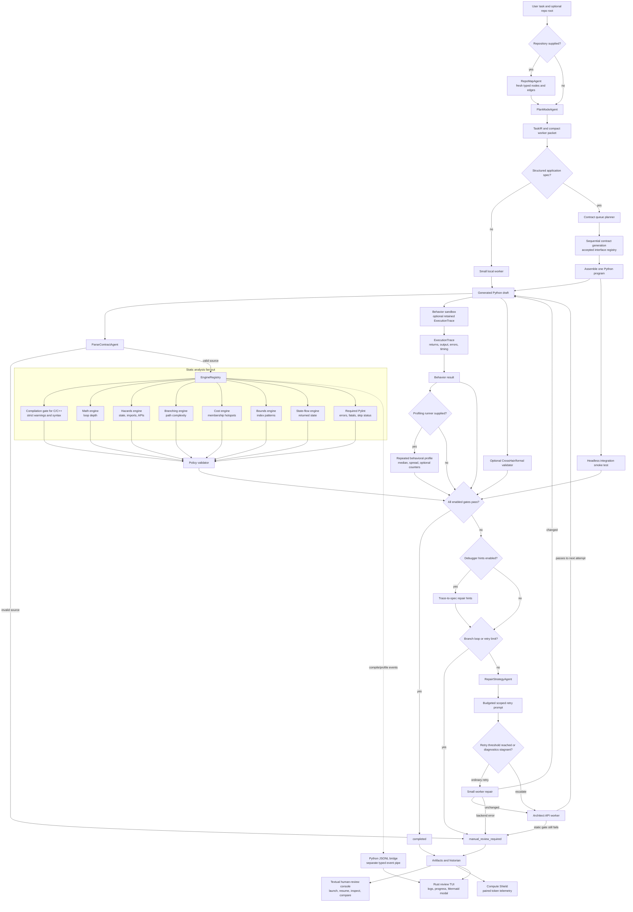

# Agent Small Harness

> Documentation audit: 2026-07-30. Commands and component names below reflect
> the current local tree. Dated files under `docs/` remain historical records.

Agent Small Harness is a Python-first research and engineering prototype for
validated code generation. It studies how far small local coding models can go
when they are wrapped in deterministic software-engineering gates, scoped repair
prompts, artifact logging, and optional architect-model escalation.

The project is designed for two audiences:

- Research: measuring model contribution, repair loops, static-analysis value,
  behavior validation, and escalation boundaries.
- Jobs and portfolio review: demonstrating practical systems engineering around
  LLM code generation, not just prompt demos.

## Core Idea

The model writes code, but the harness decides whether the code is acceptable.

```text
user task
  -> optional fresh repository map
  -> Plan Mode / TaskIR / compact worker packet
  -> small local worker model
  -> parse contract
  -> static engines
  -> real behavior execution trace and optional formal validation
  -> optional debugger hints and scoped repair prompt
  -> optional architect escalation
  -> completed or manual_review_required
```

Every draft, including output from the architect model, must pass the same gates.
No model output is trusted by default.

## Current Scope

The reliable target is Python.

C and C++ have a strict compiler gate. Tree-sitter remains the optional
structural-analysis layer, while the main development lane is Python code
creation, repair, and validation.

The harness is intentionally generalized. Example specs such as Snake and Pong
are kept as external experiment inputs and smoke-test fixtures, not as the
definition of the product or controller behavior.

### Implemented Features

| Capability | Current behavior |
| --- | --- |
| Repository mapping | `RepoMapAgent` walks Python files with `ast`, records functions, calls, returns, classes, all discovered variables, mutations, loop depth, and classified imports, and emits typed graph nodes/edges for compact Plan Mode context, JSON artifacts, or live Mermaid output. |
| Structured planning | `PlanModeAgent` builds `TaskIR`, behavior examples, state rules, graph context, adapter constraints, and compact worker packets. Repo context is opt-in through a supplied root or graph. |
| Local model generation | Ollama workers use configurable Qwen model profiles; harder failures can escalate to a separately configured architect model. |
| Deterministic validation | Parsing, seven Python engine checks, policy evaluation, required Pylint, behavior checks, optional Deal examples, and optional CrossHair decide acceptance. |
| Runtime tracing | `ExecutionAgent` runs parsed drafts against behavior cases in the isolated subprocess and captures returns, stdout, stderr, exceptions, timing, and match status in an `ExecutionTrace`. |
| Debugger hints | The opt-in debugger hook converts trace/spec differences into bounded repair instructions instead of returning only a generic behavior failure. |
| Bounded repair | Retry prompts preserve current failures and drafts under a prompt budget, detect stagnation/branch loops, and validate every worker or architect revision again. |
| Structured-spec applications | Architect-ordered contract queues carry accepted field types and method arities forward, validate imports per contract, assemble one Python program, and run a bounded headless smoke test. |
| Review evidence | Optional run artifacts preserve prompts, attempts, diffs, findings, execution traces, validation results, token estimates, and timelines. |
| Human review TUI | The existing Textual process remains the stable interface. A Rust `ratatui` client now provides a non-blocking JSONL subprocess bridge and an in-process Mermaid-to-terminal-image modal; it is an additive preview until parity is verified. |
| C/C++ compilation gate | Registered C/C++ drafts run a strict, timeout-bounded compiler pass (`-Wall -Wextra -Werror -fsyntax-only`) before later validation. Optional tree-sitter engines add structural checks when installed. |
| Algorithmic profiling | An opt-in behavioral profiler measures repeated callable variants, reports median/spread and optional hardware counters, and only identifies a faster ordering beyond a documented noise floor. |
| Compute Shield metrics | A task-level evaluator reads recorded model-token telemetry from paired artifacts, preserves each comparison row, and reports the exact aggregate delta; it is evidence, not an acceptance gate. |
| API boundary | FastAPI exposes synchronous runs, asynchronous submission, persisted job status, and health checks. |

## Engine Layer

Python drafts pass through a registered engine set:

| Engine | Purpose |
| --- | --- |
| Parse contract | Rejects invalid or unsupported source before analysis |
| Math engine | Measures loop nesting and growth risk |
| Hazards engine | Flags global/module-state mutation, unsafe calls, external imports, and unknown registered-library APIs |
| Branching engine | Measures cyclomatic complexity and branch density |
| Cost engine | Detects avoidable algorithmic hotspots such as repeated linear membership in loops |
| Bounds engine | Warns on high-confidence out-of-bounds read/write patterns |
| State-flow engine | Flags helper functions that update parser/event state without returning it |
| Lint engine | Required Pylint-backed fatal/error gate; skipped runs require explicit policy allowance |
| Compilation engine | For C/C++, invokes an available Clang/GCC compiler with warnings promoted to errors and returns bounded diagnostics |

Static checks are paired with behavior validation. A draft can be structurally
clean and still fail if it does not satisfy the expected input/output behavior.

The algorithmic profiler is intentionally not a default static engine: callers
must supply two behaviorally equivalent operations to compare, so it cannot
infer performance from AST shape or accidentally reject unrelated tasks.
Compute Shield is likewise an evaluation metric rather than a gate.

`GenerationController(profiling_runner=...)` is the opt-in integration seam.
Results and failures are stored on every attempt, included in checkpoints and
review artifacts, surfaced in the Textual console, and used by the existing
repair/manual-review decision path. With no runner, the attempt shape records
profiling as disabled and behavior is unchanged.

## Rust TUI preview

The Rust interface owns the terminal while Python continues to own the harness,
models, engines, and artifacts. They communicate through newline-delimited JSON
over a local subprocess—no server or port is introduced.

```bash
make rust-tui REPO_ROOT=.
make test-rust
```

The primary view keeps main output and repository context above persistent
context, prompt, and settings panels. Press `p` to type a live request and
`Enter` to send it through Plan Mode, DeepSeek contract planning, and the small
worker queue. `m` focuses/refreshes the repository panel and eagerly loads its
typed file, summary, symbol, import, and variable records. `Up`/`Down` then
navigate that cached list without an IPC call. While focused, `r` shows the
selected file's variables/imports and `t` shows its summary and symbols in a
split list/detail modal. Outside repository focus, `r` retains the
coding-capability shortcut. `d` opens run history, `Esc` leaves the current
focus/overlay, and `q` cancels before exiting.

Kitty and Ghostty use the directly emitted Kitty graphics protocol; iTerm2 and
WezTerm use directly emitted iTerm2 inline images. Other terminals, including
Apple Terminal and Windows Terminal, use the built-in quadrant-block renderer,
which represents a 2×2 pixel region in every colored terminal cell. Renderer
detection uses terminal environment markers and does not perform a blocking
stdio capability query.
The Python bridge allowlists
entrypoints and flags and wraps child output in typed log events so ordinary
CLI text cannot corrupt the protocol.

Controller events use a separate inherited file descriptor from CLI stdout.
That keeps human log output and typed `compile_gate_result` /
`profiling_result` messages independent while still using one local child
process.

Paired Compute Shield artifacts can be aggregated without rerunning models:

```bash
make compute-shield COMPUTE_SHIELD_ARGS="\
  --baseline-run matrix=artifacts/runs/baseline-matrix \
  --shielded-run matrix=artifacts/runs/shielded-matrix \
  --output artifacts/compute-shield.json"
```

Rust is required for these two targets. The Textual `make tui` command remains
supported during rollout.

## Execution Flow



The repository map is rebuilt when requested instead of cached. Its JSON graph
contains module, function, variable, and loop nodes plus containment,
declaration, call, import, and mutation edges. Execution
tracing and debugger hints are independently configurable and default off.
Behavior validation still executes real examples when tracing is not retained;
the trace option controls whether the richer evidence is attached to attempts
and made available to the debugger hook. Architect output always returns to the
same parse and validation path as local-worker output. Algorithmic profiling is
also opt-in: a caller supplies a profiling runner with equivalent variants.
When enabled, it participates in the same retry/manual-review path and its
results persist beside behavior and formal evidence.

### What Each Engine Traverses

Every Python engine exposes `scan(source)` and returns `EngineFinding` records.
The registry runs them in one pass over the draft, then `validation/policy.py`
turns the findings into blocking or advisory violations. The traversal details
below describe what each loop is doing and what it can detect.

| Engine | Traversal and loop behavior | What it checks | Result |
| --- | --- | --- | --- |
| `engine-0-decomposition` | `_IRBuilder` walks the complete AST. Function visits push and pop `scope_stack`; `for` and `while` visits increment/decrement loop depth and record a nested path; assignment, augmented-assignment, call, `if`, and `global` visitors record structural facts. | Builds the shared structural view: functions, loop types/depth, branches, mutations, explicit globals, module containers, symbols, membership checks, bounds risks, and state-flow risks. | `StructuralIR`, consumed by Math, Hazards, Branching, Cost, Bounds, and State-flow. It is a supporting analysis rather than a registered policy gate. |
| `engine-1-math` | Reuses `StructuralIR.loops` and scans the recorded loop list for the maximum depth and deepest path. | Whether nesting exceeds the policy threshold of two; reports the loop path and its `for`/`while` shape. | One low/medium/high finding with `max_loop_depth`; policy blocks values above the configured limit. |
| `engine-2-hazards` | Reuses IR mutation/global records. Separate AST walks iterate import nodes to classify dependencies, import bindings to resolve registered libraries, and call nodes to validate API paths. | Explicit `global`, mutation of module-level containers, indexed module-state writes, non-standard-library imports, and calls missing from a registered library schema. | One finding per hazard category, with names, calls, imports, locations, and repair hints. |
| `engine-3-branching` | Starts with IR loops and branches, then walks the AST for exception handlers, assertions, conditional expressions, boolean operands, and comprehension filters. A nested function visitor repeats the decision count per function while skipping nested functions. | Cyclomatic-style path density at module and function scope, including decisions that are not plain `if` statements. | Complexity metrics and the worst function; policy blocks complexity above seven. |
| `engine-4-cost` | Consumes `StructuralIR.symbols` and `StructuralIR.membership_checks`. The IR builder records assignments, annotations, arguments, constructors, `for`/`while`, comprehensions, and `in`/`not in` comparisons with scope and line information. | Repeated membership against an inferred `list` or `tuple` inside a loop, which can become an avoidable linear lookup hotspot. | Container names, lines, and hotspot count; policy can require a precomputed set. |
| `engine-5-lint` | Writes the draft to a temporary file and delegates traversal to Pylint. It parses the returned JSON and filters registered dynamic-library `no-member` messages into non-blocking warnings. | Pylint fatal/error categories, while allowing known dynamic members from the library registry. | Blocking lint findings or an explicit skipped/unavailable/timeout result. Pylint is a base dependency because skipped lint blocks completion by default. |
| `engine-6-bounds` | Consumes `StructuralIR.bounds_risks`, populated while the IR builder visits every subscript and `for` loop whose iterator is a `range(...)` call. | High-confidence one-past-end reads/writes and range upper-bound overflow patterns. | Warning-first bounds finding with expressions and lines; full dataflow proof is intentionally out of scope. |
| `engine-7-state-flow` | Consumes `StructuralIR.state_flow_risks`, populated while the IR builder walks each function’s descendant nodes for state-parameter assignments and return values. | Helpers that mutate parameters named like state/context/section/current/total but fail to return the updated value. | Potential lost-state finding with function, parameter, and line; policy blocks it by default. |

#### Current IR Boundary

`DecompositionEngine` is the shared structural source for Math, Hazards,
Branching, Cost, Bounds, and State-flow. The IR now carries scope-qualified
symbols, membership checks, bounds risks, and state-flow risks so those engines
do not need their own top-level `ast.NodeVisitor` for the same facts. Lint
remains separate because Pylint owns its traversal and is intentionally external
to the Python IR.

#### Reading a Finding

The engine finding is not the final decision. The path is:

```text
AST/source
  -> engine traversal
  -> EngineFinding(metrics, diagnostic, severity)
  -> policy threshold and allow-list evaluation
  -> structural violation set
  -> repair prompt, completion, or manual review
```

This is why a low-severity finding can still be useful telemetry, while a
high-severity finding only blocks the run when its corresponding policy says it
is disallowed.

Structured app specs can also use the function-contract queue path:

```text
structured spec
  -> PlanModeAgent
  -> fallback or architect-ordered contract queue
  -> sequential function/class contract generation
  -> per-contract validation and repair
  -> architect integration of accepted symbols
  -> normal parse, engine, policy, behavior, and formal gates
  -> completed or manual_review_required
```

This path is what app-scale smoke specs such as Pong and Snake exercise. It has
its own failure modes: contract dependency blocking, oversized integration
prompts, architect truncation, and final module-level static/spec validation.
Those outcomes are recorded in artifact metadata and the contract queue results.

## Important Design Properties

- Python-first: the stable path uses the standard-library `ast` stack.
- Generalized: no app-specific route is baked into the controller or Plan Mode.
- Deterministic gates: parsing, static checks, policy, behavior, and optional
  formal validation decide completion.
- Architect is not trusted: API output is rescanned by the same gates.
- Human-centered operation: the harness gathers evidence, explains failures,
  and proposes repairs; `completed` means the configured checks passed, not
  that a human has delegated final ownership or judgment to the harness.
- Artifact-driven review: attempts, prompts, diffs, validations, and summaries
  are saved under `artifacts/runs/` when requested. Interrupted capability and
  worker-limit runs can resume from their atomic `checkpoint.json`.
- Contribution measurement: ladder tests record whether the small worker solved,
  repaired, helped the architect, stalled, or required manual review.

## Repository Map

| Path | Purpose |
| --- | --- |
| `agents/generation_controller.py` | Main create/repair loop, compilation/profiling event emission, opt-in profiling gate, execution-trace attachment, debugger-hint injection, stagnation guard, branch-loop detection, architect escalation, and final status |
| `agents/artifact_manager.py` | Checkpoints sessions and preserves drafts, traces, profiling evidence, findings, token telemetry, and review timelines |
| `agents/repo_map_agent.py` | Fresh AST repository map with functions, calls, returns, variables, loops, imports, compact context, and Mermaid rendering |
| `agents/execution_agent.py` | Isolated behavior-case execution and structured runtime trace capture |
| `agents/plan_mode.py` | Converts raw user intent and optional repository context into behavior examples, constraints, graph context, and `TaskIR` |
| `agents/engine_registry.py` | Routes parsed source to the registered engine set |
| `agents/job_store.py` | File-locked append-only JSONL job store used by asynchronous run/status endpoints |
| `agents/parse_contract.py` | Language detection and parser gate |
| `agents/repair_strategy.py` | Converts violations into scoped repair instructions |
| `agents/template_registry.py` | Optional injected template-route selector, with no built-in app-specific route |
| `harness_kernel/task_ir.py` | Structured task/spec handoff types |
| `harness_kernel/function_contracts.py` | Function-level contract queue and Deal scaffold rendering |
| `harness_kernel/execution_kernel.py` | Thin execution wrapper around the controller |
| `harness_kernel/event_stream.py` | Optional inherited JSONL event descriptor used by subprocess review clients |
| `harness_kernel/tui_bridge.py` | Rust-client command bridge and typed event/log forwarding boundary |
| `harness_kernel/profiling.py` | Opt-in repeated behavioral comparison with a documented noise floor |
| `harness_kernel/compute_shield.py` | Paired artifact-token accounting and aggregate delta |
| `engines/compilation_engine.py` | Strict Clang/GCC compilation gate for C/C++ |
| `engines/` | Remaining static analysis engines |
| `validation/behavior.py` | Isolated behavior execution, `ExecutionTrace`, and derived behavior results |
| `validation/debugger.py` | Bounded trace-to-spec repair hints for debugger mode |
| `validation/` | Policy, import validation, Deal/CrossHair formal validation, branch-loop detection, and violation types |
| `prompt/` | Initial, retry, architect, and contract-architect prompt builders |
| `backends/` | Ollama worker and API architect clients |
| `api/` | FastAPI boundary for synchronous runs, asynchronous jobs, status lookup, and health checks |
| `TUI/` | Separate Textual review process, JSON/subprocess data source, live checkpoint screen, repo-map modal, attempt diffs, and history hints |
| `scripts/run_repo_map.py` | Repository-map CLI for compact context, JSON, Mermaid, and optional artifacts |
| `scripts/run_compute_shield.py` | Aggregates matching baseline/shielded artifact telemetry without rerunning models |
| `scripts/run_structured_spec.py` | Plan-only or full contract-queue generation, integration, validation, and smoke execution |
| `scripts/` | Ladder runners, raw-vs-harness comparison, history aggregation, and review tools |
| `tests/` | Unit, integration, edge-case, ladder, and pipeline tests |
| `pyproject.toml` | Python package metadata and runtime dependencies |
| `Dockerfile` | Container entrypoint for the synchronous API service |
| `.github/workflows/ci.yml` | Push/PR workflow for tests and Docker image build |
| `design.md` | Architectural constraints and safety principles |
| `structure.md` | File-by-file repository map |

## Setup

Install the base runtime and optional formal-verification dependencies:

```bash
make install
make install-formal
```

The Rust preview additionally requires a Rust toolchain with `cargo`. It is not
required for the Python harness or Textual TUI:

```bash
rustup toolchain install stable
make test-rust
```

Pull local Ollama models as needed:

```bash
ollama pull qwen2.5-coder:1.5b
ollama pull qwen2.5-coder:3b
```

For architect escalation, create a local `.env` file:

```env
DEEPSEEK_API_KEY=your_key_here
ARCHITECT_MODEL=deepseek-v4-pro
```

`config.yaml` separates architect profiles:

- `execution.architect.contract` uses a bounded `deepseek-v4-pro` JSON-only path for function contract queues.
- `execution.architect.repair` uses a separate bounded repair profile for code repair after worker failure.

`.env` is ignored by git. Use `.env.example` as the committed template.
The Rust TUI bridge loads this repository-level `.env` before launching prompt
runs. Values already exported by the launching shell take precedence. If
`DEEPSEEK_API_KEY` is unavailable from both sources, the TUI shows a startup
warning and reports the failed prompt as a highlighted error.
Transient architect API failures are retried by default. Tune
`ARCHITECT_RETRY_ATTEMPTS` and `ARCHITECT_RETRY_BACKOFF_SECONDS` in `.env` when
needed.

Check the env-file location and supported key names:

```bash
make env-path
```

## Common Commands

Show command help:

```bash
make help
```

Run the API:

```bash
make api-dev
```

Launch the human-review TUI:

```bash
make tui
```

The TUI is deliberately outside the control loop. It launches the existing CLI
scripts as subprocesses and reads their JSON checkpoints. `Q` quits, `R`
resumes the selected run, `M` opens the repository-map modal, `D` shows
successive-attempt diffs, and `H` searches similar past attempts. The
architecture modal defaults to human-scale package layers with dependency
summaries and module filtering. A raw node tree, LLM Plan context, and full
Mermaid source remain available as diagnostic views. **Open Diagram** renders
the small layer graph with local `mmdc` when installed, or opens a generated
browser page using Mermaid JS as a fallback.

The first service boundary is intentionally small:

```text
GET  /health
POST /runs/sync
POST /runs/async
GET  /runs/{job_id}
```

`POST /runs/sync` accepts `target`, `spec`, optional `max_retries`, `language`,
`model`, `ollama_url`, and `use_architect`. The default app wires `spec` through
`OllamaModelSupplier.generate_draft`, uses the same supplier for repairs, and
optionally enables `ArchitectModelSupplier.repair_draft` for escalation. It then
calls `GenerationController.run()` synchronously and returns the validated
controller result.

Backend failures return structured JSON with an error code and recovery action
instead of an unstructured server error.

`POST /runs/async` returns a job ID immediately and runs the same controller in
the background. `GET /runs/{job_id}` reads its persisted status, lifecycle
events, and result from `JsonlJobStore`. Set `JOB_STORE_PATH` to change the
default `data/jobs.jsonl` location.

Build the local API image:

```bash
make docker-build
```

The image runs `uvicorn api.app:app` on port `8000`. Pass secrets such as
`DEEPSEEK_API_KEY` at runtime; `.env` is excluded from the image context.

Map a repository before generation or render its dependency graph:

```bash
make repo-map REPO_ROOT=. REPO_MAP_FORMAT=context
make repo-map REPO_ROOT=. REPO_MAP_FORMAT=json
make repo-map REPO_ROOT=. REPO_MAP_FORMAT=mermaid
```

Run only structured-spec planning, or execute the full contract queue with the
local Qwen worker and architect fallback:

```bash
make structured-spec-plan SPEC_PATH=examples/specs/snake_game_spec.md
make structured-spec SPEC_PATH=examples/specs/snake_game_spec.md \
  MODEL=qwen2.5-coder:1.5b SAVE_ARTIFACTS=1
```

Runtime trace retention and debugger hints are opt-in in `config.yaml`:

```yaml
engines:
  behavior:
    execution_trace: true
    debugger_hints: true
```

Run deterministic validation:

```bash
make test
make evaluate-engines
make test-behavior
make test-engine-edge-cases
```

Run model capability experiments:

```bash
make test-worker-limit MODEL=qwen2.5-coder:3b SAVE_ARTIFACTS=1
make test-worker-limit-auto SAVE_ARTIFACTS=1
make test-raw-vs-harness MODEL=qwen2.5-coder:3b
make test-raw-vs-harness-architect MODEL=qwen2.5-coder:3b
make test-raw-vs-harness-repeated MODEL=qwen2.5-coder:1.5b RAW_VS_HARNESS_SAMPLES=5
make test-raw-vs-harness-ablation MODEL=qwen2.5-coder:1.5b RAW_VS_HARNESS_SAMPLES=5
```

Run focused Python ladders:

```bash
make test-python-ladder-parsing MODEL=qwen2.5-coder:3b
make test-python-ladder-data MODEL=qwen2.5-coder:3b
make test-python-ladder-algorithmic MODEL=qwen2.5-coder:3b
make test-python-ladder-stateful MODEL=qwen2.5-coder:3b
```

Run architect escalation:

```bash
make test-worker-limit-architect MODEL=qwen2.5-coder:3b SAVE_ARTIFACTS=1
make test-python-ladder-stateful-architect MODEL=qwen2.5-coder:3b SAVE_ARTIFACTS=1
```

Review saved artifacts:

```bash
make review-run RUN=<run-id-or-path>
make resume-coding-capability RESUME_RUN=<run-id>
make resume-worker-limit RESUME_RUN=<run-id>
make resume-structured-spec SPEC_PATH=<original-spec> RESUME_RUN=<run-id>
```

Discover a library API surface and ask DeepSeek for documentation by default:

```bash
make discover-library LIB=clang.cindex
```

That command writes a reviewable proposal to
`data/library_proposals/<LIB>.json` and a model-generated syntax guide to
`data/library_proposals/<LIB>.docs.md`. Use `DOC_AGENT=qwen` to ask local Qwen,
`DOC_AGENT=kernel` to search and verify documentation pages in a Kernel cloud
browser, or `DOC_AGENT=none` to write an import-only proposal without
documentation search. Kernel search requires `requirements-kernel.txt` and
`KERNEL_API_KEY` in `.env`.

Approve a reviewed proposal into the trusted library registry:

```bash
make approve-library LIB=clang.cindex
```

## Research Questions This Repo Supports

- Does a deterministic engine layer improve small-model code reliability?
- Which failures are structural and which are semantic?
- When does a small local model stop contributing meaningful changes?
- Does compact graph/state context improve repair quality?
- How often does architect escalation rescue a failed small-worker run?
- Which engines produce useful repair pressure, and which create false positives?

## Project Checklist

### Implemented

- [x] Generalized Python create/repair controller with bounded local-worker and
  architect retry paths.
- [x] Fresh AST repository mapping with compact Plan Mode context and on-demand
  typed JSON/Mermaid graphs for calls, imports, variables, loops, and mutations.
- [x] Shared structural IR plus math, hazards, branching, cost, bounds,
  state-flow, and required Pylint gates.
- [x] Real isolated behavior execution with structured per-case traces.
- [x] Opt-in trace-to-spec debugger hints in repair prompts.
- [x] Prompt budgeting, architect response continuation, stagnation detection,
  and branch-loop detection.
- [x] Structured-spec contract queues with import-symbol validation, accepted
  field/method context, single-file integration, and headless smoke execution.
- [x] Synchronous and asynchronous API endpoints with persisted job status.
- [x] Artifact capture, history aggregation, capability ladders, and
  raw-versus-harness comparisons.
- [x] Bounded lexical retrieval of similar past attempts as optional advisory
  prompt context; current runtime evidence, validation gates, and human review
  remain authoritative.
- [x] Uniform typed dispatch for lint, sandbox execution, both model backends,
  and Deal/CrossHair formal verification.
- [x] Formal CI dependencies installed on every run so Deal/CrossHair coverage
  does not silently remain skipped.
- [x] Durable repeated paired comparisons that retain raw drafts, repaired
  attempts, per-sample ranges, variance, Wilson confidence intervals, and
  aggregate recovery lift.
- [x] Opt-in naive-repair ablation comparing raw output, one behavior-only
  repair call, and the full validation/repair/architect harness.
- [x] Contract-boundary checkpoint/resume for structured-spec queues.
- [x] Task-agnostic wildcard-import blocking with qualified-symbol repair
  guidance.
- [x] Review-before-trust library discovery and registry approval workflow.
- [x] Artifact-driven Textual review console with CLI launch/resume, live
  attempt and contract-queue status, repo-map Mermaid text/SVG handoff,
  unified attempt diffs, and advisory history search.
- [x] Rust TUI preview with a Tokio three-source event loop, typed JSONL
  subprocess protocol, responsive state reducer, and in-process Mermaid
  SVG-to-terminal-image modal.
- [x] Strict C/C++ compilation gate plus opt-in algorithmic profiling and
  task-level Compute Shield token accounting.

### Remaining Work

- [ ] Complete manual terminal compatibility passes for the directly emitted
  Kitty and iTerm2 protocol paths before making the Rust TUI the default. The
  quadrant-block fallback has been smoke-tested in Apple Terminal.
- [ ] Run and publish a frozen 10-task Compute Shield experiment; the exact
  task-level accounting exists, but no model-dependent result is claimed.
- [ ] Expose `repo_root`, execution-trace retention, and debugger controls
  through the public API and remaining standalone run commands; the capability,
  worker-limit/Python-ladder, and raw-versus-harness drivers already honor the
  strict config toggles.
- [ ] Expand debugger mode from bounded case-level hints to step/state deltas,
  cross-contract failure localization, and reproducible minimal failing cases.
- [ ] Add multi-file generation with explicit file ownership, cross-file symbol
  and type contracts, dependency ordering, and whole-project integration tests.
- [ ] Add adversarial runtime isolation beyond the current timeout-bound Python
  subprocess before accepting untrusted code in a shared or hosted deployment.
- [ ] Extend the repeated paired benchmark beyond Qwen 1.5B and publish
  confidence intervals across models and larger task sets.
- [ ] Add authentication, authorization, rate limits, and production-grade job
  storage before exposing the API outside a trusted local environment.
- [ ] Version the debugger and repository-map artifact/report schemas and add
  backward-compatibility tests for external consumers.

The public direction remains generalized code creation and repair. App-like
specs are stress fixtures, and discovered library documentation remains proposal
data until a human approves it into `data/library_registry.json`.

## Run-storage contract

JSON artifacts remain the source of truth. Repeated comparisons write one batch
summary plus per-sample, per-task raw drafts and attempt timelines. The TUI
reads that stable artifact schema through `HarnessDataSource`; screens never
read artifact files directly. If cross-run querying becomes a bottleneck,
SQLite should be a rebuildable index behind that data-source seam, not a second
authoritative store.

## Safety Boundary

Generated code is never accepted from model text alone. The controller requires
successful parsing, registered engine checks, policy validation, behavior
validation when available, and optional formal checks when enabled. Otherwise the
run ends as `manual_review_required`. These gates organize evidence for a human
reviewer; they do not make deployment, merge, or product-acceptance decisions on
the reviewer's behalf. Manual review is a normal terminal outcome, not a harness
failure.
