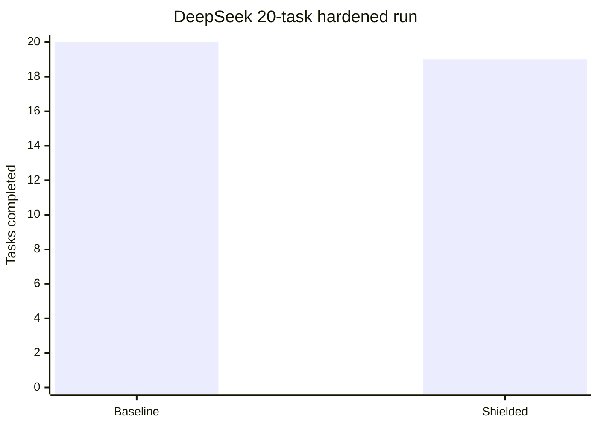
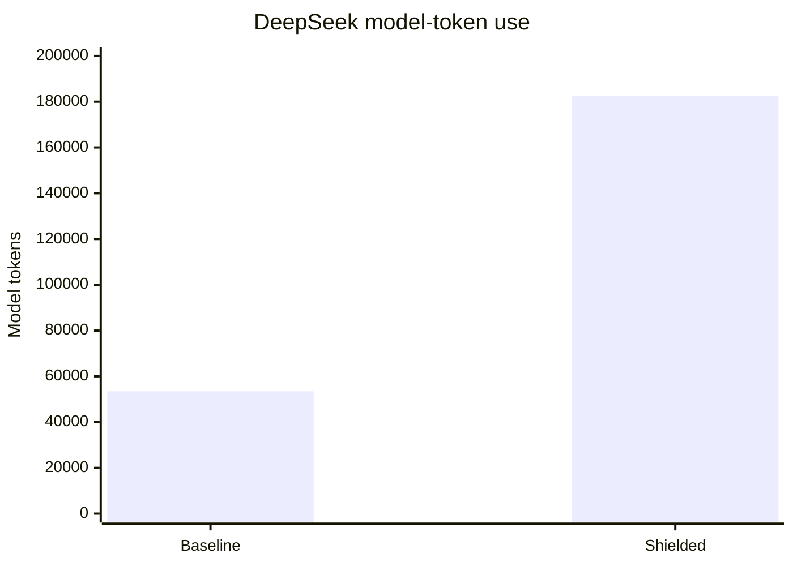
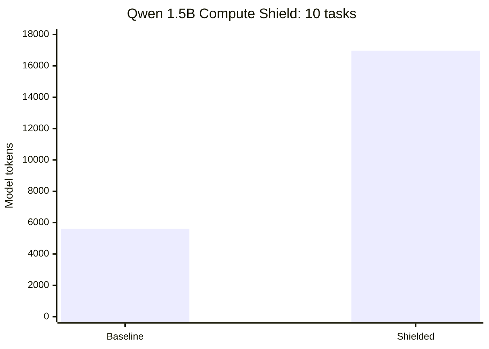
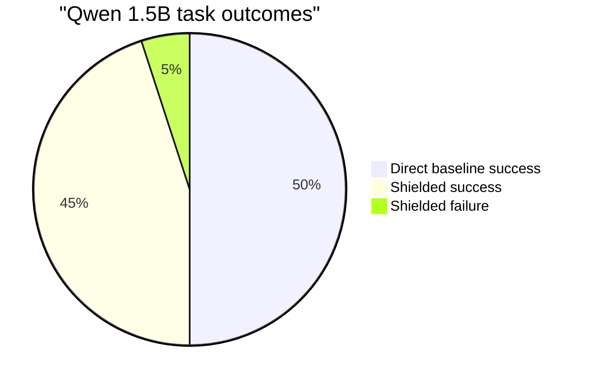
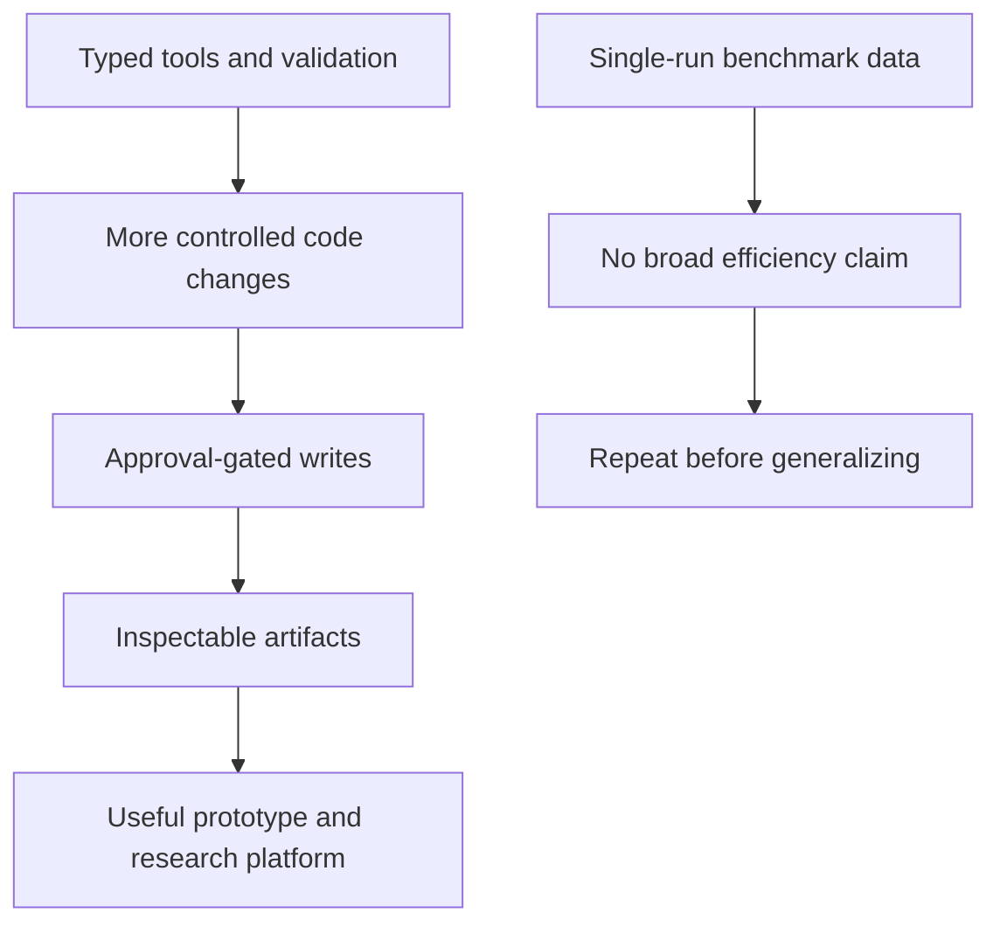

# Research report

> Updated: 2026-08-11 · Evidence source: committed reports under
> [`docs/results/`](docs/results/)

## Executive summary

The harness has a working, approval-gated coding loop with deterministic
validation. The published experiments show that loop hardening improved task
completion, but they do **not** show a token-saving advantage. This is a useful
research result: stronger control loops can trade cost for reliability.

## Published benchmark snapshot





| Measure | Comparable baseline | Hardened shielded loop | Difference |
| --- | ---: | ---: | --- |
| Successful tasks | 20/20 | 19/20 | -1 task |
| Model tokens | 53,467 | 182,661 | 3.42× baseline |
| Tool calls | 0 | 76 | Tool-loop overhead is visible |
| Wall-clock time | 197.7s | 240.5s | 1.22× baseline |

The hardened loop improved from the earlier 11/20 shielded result to 19/20,
but that comparison is historical—not a repeated confidence estimate.

## Frozen local-model result





| Measure | Direct baseline | Shielded loop | Difference |
| --- | ---: | ---: | --- |
| Successful tasks | 10/10 | 9/10 | -1 task |
| Model tokens | 5,606 | 16,973 | 3.03× baseline |
| Aggregate wall time | 262.4s | 153.4s | Shielded was faster |

## Controlled local-model comparison

On 2026-08-11, the same versioned ten-task Compute Shield corpus was run
sequentially on the installed Qwen 1.5B and 3B models. Both completed all ten
shielded tasks. The 3B run used fewer model tokens and tool calls, but took
longer wall-clock time. This is an observed two-model result, not evidence of
a general parameter-scaling relationship.

| Measure | Qwen 1.5B | Qwen 3B | 3B − 1.5B |
| --- | ---: | ---: | ---: |
| Shielded successes | 10/10 | 10/10 | 0 tasks |
| Shielded tokens | 19,432 | 14,341 | -5,091 |
| Shielded tool calls | 17 | 12 | -5 |
| Shielded wall time | 205.6s | 355.3s | +149.6s |

The generated comparison is
[local-model-comparison-2026-08-11.md](docs/results/local-model-comparison-2026-08-11.md);
the two raw reports are published alongside it under `docs/results/raw/`.

## What the evidence supports



Supported today:

- Reviewable multi-file diffs and explicit human approval.
- Deterministic checks, container-backed execution, and captured evidence.
- Repeatable fixed-task benchmark tooling that retains failures and raw runs.

Not supported today:

- A claim that the shielded loop saves tokens or money.
- Generalization from the present corpus to other models or repositories.
- A monotonic relationship between model parameter count and completion: both
  local models completed the same fixed corpus.
- Safe multi-user hosting.

## Next measurement

Run the exact three-repeat corpus on a terminal that can remain active for the
full experiment:

```bash
make research-agent-benchmark \
  RESEARCH_RUNS=3 \
  BASELINE_CMD="python3 scripts/run_deepseek_benchmark_agent.py --mode baseline" \
  SHIELDED_CMD="python3 scripts/run_deepseek_benchmark_agent.py --mode shielded" \
  RESEARCH_OUTPUT=artifacts/research/deepseek-repeated.json
```

Publish the raw JSON and a dated report whether the results improve or not.
That is the last step needed to move from a compelling prototype report to a
repeatable research claim.

The report renderer and second corpus are now part of the reproducibility
surface. After a raw run completes, render its committed report with:

```bash
make research-report \
  REPORT_INPUT=docs/results/raw/deepseek-repeated.json \
  REPORT_OUTPUT=docs/results/deepseek-repeated-YYYY-MM-DD.md
```

Then run `make research-fixture-deepseek` and `make research-fixture-qwen` on
the versioned fixture corpus. The evidence remains incomplete until those raw
reports and the five approval-session receipts are published.
