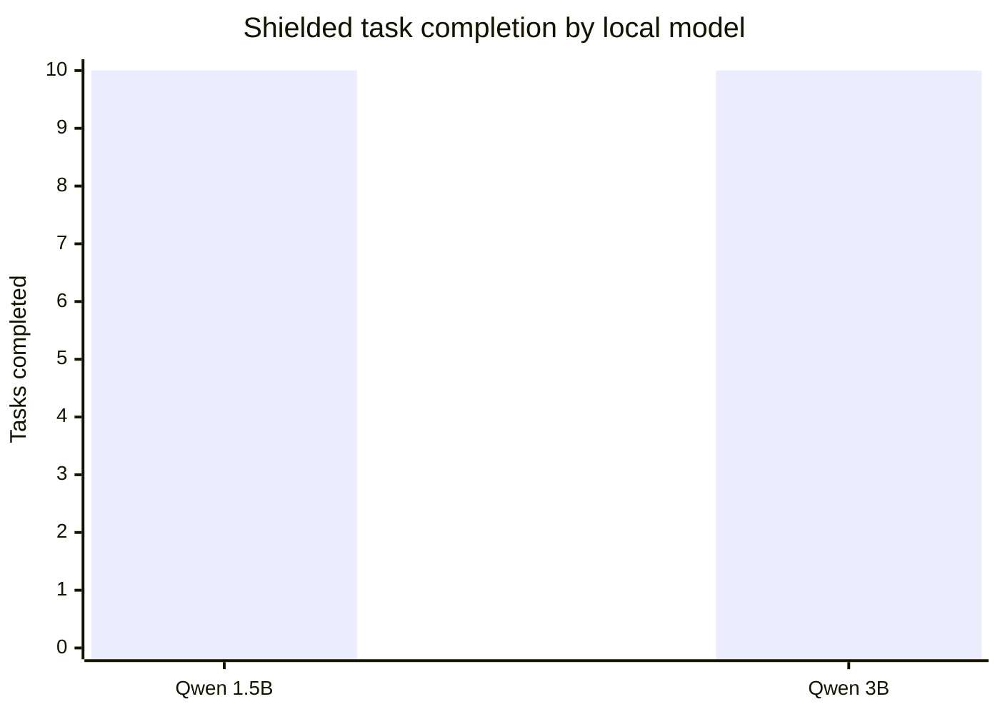
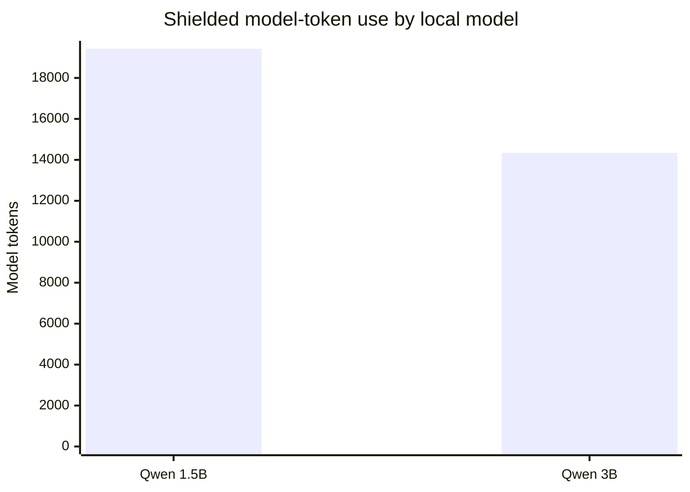

# Local model-size comparison: Qwen 1.5B vs 3B

> Generated: 2026-08-11 · Fixed ten-task Compute Shield corpus

## Controlled comparison

Both reports use the same versioned ten-task corpus and baseline/shielded protocol. This is a two-model observation, not a parameter-scaling law.

| Measure | Qwen 1.5B | Qwen 3B | 3B − 1.5B |
| --- | ---: | ---: | ---: |
| Baseline successes | 10.00 | 10.00 | +0.00 |
| Shielded successes | 10.00 | 10.00 | +0.00 |
| Baseline tokens | 5606.00 | 4075.00 | -1531.00 |
| Shielded tokens | 19432.00 | 14341.00 | -5091.00 |
| Baseline wall seconds | 313.58 | 456.53 | +142.95 |
| Shielded wall seconds | 205.64 | 355.28 | +149.64 |
| Shielded tool calls | 17.00 | 12.00 | -5.00 |

## Interpretation

On this fixed corpus, both models achieved the same shielded completion count. The result does not support a monotonic parameter-size claim.
