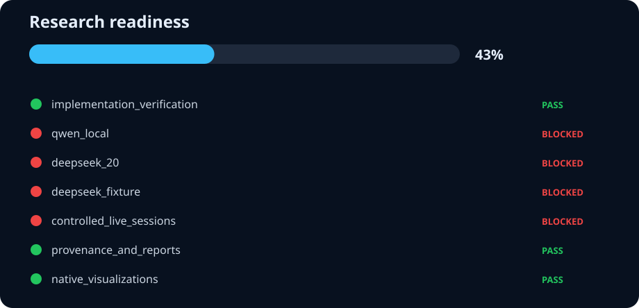

# Research readiness

**Authoritative result: 43% · blocked**

| Gate | Status | Evidence |
| --- | --- | --- |
| implementation_verification | pass | docs/results/raw/readiness/verification.json |
| qwen_local | blocked | docs/results/raw/fixture-qwen-1.5b-repeated-2026-08-16.json |
| deepseek_20 | blocked | docs/results/raw/deepseek-20-health-gated-2026-08-17.json |
| deepseek_fixture | blocked | docs/results/raw/fixture-deepseek-repeated-2026-08-16.json |
| controlled_live_sessions | blocked | docs/results/raw/live_sessions/plain_question-2026-08-19.json; docs/results/raw/live_sessions/unavailable_api-2026-08-19.json |
| provenance_and_reports | pass | docs/results/raw/formal-counterexample-repair-general-directive-2026-08-16.json; docs/results/raw/compute-shield-10-2026-08-16.json; docs/results/raw/fixture-deepseek-repeated-2026-08-16.json; docs/results/raw/fixture-qwen-1.5b-repeated-2026-08-16.json; docs/results/raw/formal-counterexample-repair-routed-behavioral-fallback-2026-08-17.json; docs/results/raw/formal-counterexample-repair-routed-2026-08-17.json; docs/results/raw/deepseek-20-repeated-2026-08-16.json; docs/results/raw/deepseek-20-health-gated-2026-08-17.json; docs/results/deepseek-20-repeated-2026-08-16.md; docs/results/fixture-qwen-1.5b-repeated-2026-08-16.md |
| native_visualizations | pass | docs/results/research-readiness.svg; docs/results/research-readiness.md |

## Blockers

- qwen_local needs a schema-v3+, three-run, provenance-complete, provider-healthy artifact.
- deepseek_20 needs a schema-v3+, three-run, provenance-complete, provider-healthy artifact.
- deepseek_fixture needs a schema-v3+, three-run, provenance-complete, provider-healthy artifact.
- missing scenarios: multi_file_edit, planning_review, small_edit
